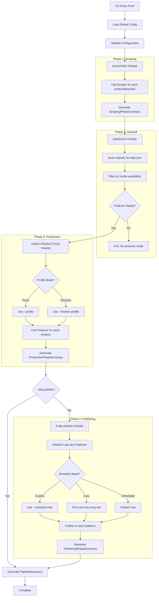

# Design Document: Batch Processing Module

## Overview

The Batch Processing Module (Global Pipeline) orchestrates end-to-end automated content production by sequencing four phases: scraping, handoff, video production, and publishing. The implementation follows a minimalist orchestration approach, treating scraper, producer, and publisher as black boxes and coordinating their execution with unified configuration and comprehensive reporting.

The design creates:
1. **Pipeline Orchestrator** (`src/pipeline/global_batch.py`) - Coordinates all four phases
2. **Configuration Management** (`src/pipeline/config.py`) - Unified configuration and data models
3. **CLI Entry Point** (`src/pipeline/__main__.py`) - Command-line interface
4. **Summary Reporting** - Aggregate statistics across all phases

## Architecture

### Module Organization

```
src/pipeline/
├── __init__.py                # Package exports
├── __main__.py                # CLI entry point (python -m src.pipeline.global_batch)
├── global_batch.py            # GlobalPipelineOrchestrator implementation
└── config.py                  # Configuration models and loading

tests/pipeline/
├── __init__.py
├── test_global_batch_orchestrator.py    # Unit tests
├── test_global_batch_integration.py     # Integration tests
└── test_global_batch_publishing.py      # Publishing phase tests

config/
└── pipeline.yaml              # YAML configuration
```

### Four-Phase Pipeline Flow



## Components and Interfaces

### Component 1: GlobalPipelineOrchestrator

- **Purpose:** Coordinate all four phases sequentially
- **Location:** `src/pipeline/global_batch.py`
- **Interfaces:**
  ```python
  class GlobalPipelineOrchestrator:
      def __init__(self, config: GlobalBatchConfig):
          """Initialize orchestrator with unified configuration"""

      async def run_pipeline(self) -> PipelineSummary:
          """Execute complete pipeline: scrape → handoff → produce → publish"""

      async def _execute_scraping_phase(self) -> ScrapingPhaseSummary:
          """Execute scraping phase and return summary"""

      def _execute_handoff_phase(self) -> list[ProductData]:
          """Discover products ready for video production"""

      async def _execute_production_phase(
          self, products: list[ProductData]
      ) -> tuple[ProductionPhaseSummary, list[tuple[str, Path]]]:
          """Execute video production phase and return summary + video paths"""

      async def _execute_publishing_phase(
          self, produced_videos: list[tuple[str, Path]]
      ) -> PublishingPhaseSummary:
          """Execute publishing phase for produced videos"""

      def _generate_final_summary(
          self,
          scraping: ScrapingPhaseSummary,
          production: ProductionPhaseSummary,
          publishing: PublishingPhaseSummary | None,
          duration: float
      ) -> PipelineSummary:
          """Generate end-to-end pipeline summary"""
  ```
- **Dependencies:** Scraper, Producer, Publisher, logging
- **Treats as Black Boxes:** BotasaurusAmazonScraper, create_video_for_product(), LatePublisher

### Component 2: Configuration Management

- **Purpose:** Load and validate unified pipeline configuration
- **Location:** `src/pipeline/config.py`
- **Interfaces:**
  ```python
  def load_global_batch_config(cli_args: argparse.Namespace) -> GlobalBatchConfig:
      """Load configuration with CLI > YAML > defaults precedence"""

  def validate_global_batch_config(config: GlobalBatchConfig) -> None:
      """Validate configuration before pipeline starts

      Raises:
          ValueError: If validation fails (no inputs, invalid profiles,
                     missing LATE_API_KEY when publishing enabled, etc.)
      """
  ```
- **Dependencies:** argparse, YAML loader, VideoConfig

### Component 3: CLI Entry Point

- **Purpose:** Provide command-line interface for global batch pipeline
- **Location:** `src/pipeline/__main__.py`
- **Usage:**
  ```bash
  python -m src.pipeline.global_batch [args]
  ```
- **Arguments:**
  - Scraper arguments: `--product-ids`, `--keywords`, `--max-products`, filters
  - Producer arguments: `--profile`, `--random-profile`, `--profile-pool`
  - Publisher arguments: `--skip-publish`, `--platforms`, `--schedule-time`, `--fail-fast-publish`
  - Common arguments: `--fail-fast`, `--outputs-dir`, `--debug`

### Component 4: Summary Reporting

- **Purpose:** Generate comprehensive statistics across all pipeline phases
- **Location:** `src/pipeline/config.py` (data models) + `src/pipeline/global_batch.py` (formatting)
- **Output Format:**
  ```
  ════════════════════════════════════════════════════════════════════════════════
  PIPELINE SUMMARY
  ════════════════════════════════════════════════════════════════════════════════

  SCRAPING PHASE:
    Total Attempted: 5
    Successful: 4
    Failed: 1
    Duration: 45.2s

  VIDEO PRODUCTION PHASE:
    Total Attempted: 4
    Successful: 3
    Failed: 0
    Skipped: 1
    Duration: 120.5s

  PUBLISHING PHASE:
    Total Attempted: 3
    Successful: 3
    Failed: 0
    Skipped: 0
    Duration: 30.1s

  END-TO-END STATISTICS:
    End-to-End Success: 3 (scraped + produced + published)
    Partial Success: 1 (scraped but not completed)
    Total Failures: 1
    Total Duration: 195.8s
  ════════════════════════════════════════════════════════════════════════════════
  ```

## Data Models

### GlobalBatchConfig

```python
@dataclass
class GlobalBatchConfig:
    """Unified configuration for global batch pipeline"""
    # Scraper configuration
    product_ids: list[str]
    keywords: list[str]
    max_products: int
    scraper_filters: ScraperFilters

    # Producer configuration
    profile: str | None
    random_profile: bool
    profile_pool: list[str]

    # Publishing configuration
    skip_publish: bool
    platforms: list[str] | None
    schedule_time: str | None
    fail_fast_publish: bool

    # Common configuration
    fail_fast: bool
    outputs_dir: Path
    debug: bool
```

### ScrapingPhaseSummary

```python
@dataclass
class ScrapingPhaseSummary:
    """Scraping phase statistics"""
    total_attempted: int
    successful: int
    failed: int
    failed_products: list[str]
    media_stats: dict[str, int]      # e.g., {"total_images": 45, "total_videos": 12}
    duration_sec: float
```

### ProductionPhaseSummary

```python
@dataclass
class ProductionPhaseSummary:
    """Video production phase statistics"""
    total_attempted: int
    successful: int
    failed: int
    skipped: int
    failed_products: list[str]
    skipped_products: list[str]
    profile_distribution: dict[str, int] | None  # Only if randomization enabled
    duration_sec: float
```

### PublishingPhaseSummary

```python
@dataclass
class PublishingPhaseSummary:
    """Publishing phase statistics"""
    total_attempted: int
    successful: int          # Published to ALL platforms
    failed: int
    skipped: int
    failed_videos: list[str]
    skipped_videos: list[str]
    platform_results: dict[str, dict[str, int]]  # Per-platform success/fail counts
    duration_sec: float
```

### PipelineSummary

```python
@dataclass
class PipelineSummary:
    """End-to-end pipeline statistics"""
    scraping: ScrapingPhaseSummary
    production: ProductionPhaseSummary
    publishing: PublishingPhaseSummary | None  # None if --skip-publish
    end_to_end_success: int     # Scraped AND produced AND published
    partial_success: int        # Scraped but not fully completed
    total_failures: int         # Failed in any phase
    total_duration_sec: float
```

## Error Handling Scenarios

1. **No Input Provided**
   - Raise `ValueError` at configuration validation
   - Message: "No product IDs or keywords provided"

2. **Invalid Profile**
   - Raise `ValueError` at configuration validation
   - Message: "Invalid profile: {profile}. Available: {available_profiles}"

3. **Missing LATE_API_KEY (Publishing Enabled)**
   - Raise `ValueError` at configuration validation
   - Message: "Publishing enabled but LATE_API_KEY environment variable not set"

4. **Scraping Phase Failure with Fail-Fast**
   - Stop pipeline immediately, skip remaining phases
   - Message: "Pipeline stopped due to scraping failure"

5. **No Products Ready After Handoff**
   - Exit gracefully after handoff phase
   - Message: "No products with sufficient media for video production"

6. **Publishing Failure with Fail-Fast-Publish**
   - Stop publishing phase, generate partial summary
   - Message: "Publishing stopped due to failure"

## YAML Configuration Schema

```yaml
global_batch:
  enabled: false
  scraper:
    product_ids: []
    keywords: []
    max_products: 10
    filters:
      min_price: 0
      max_price: 1000
      min_rating: 4.0
      prime_only: false
  video:
    profile: slideshow_images1
    random_profile: false
    profile_pool: []
    fail_fast: false
  publishing:
    skip_publish: false
    platforms: [youtube, tiktok, instagram]
    schedule_time: null       # null = auto-schedule, or ISO 8601 datetime
    immediate_publish: false  # true = publish now, false = auto-schedule
    fail_fast_publish: false
```

## Testing Strategy

### Unit Testing

**File:** `tests/pipeline/test_global_batch_orchestrator.py`

- Configuration loading and validation
- Phase coordination (correct sequence)
- Fail-fast behavior between phases
- Mock scraper, producer, and publisher for isolation

### Integration Testing

**File:** `tests/pipeline/test_global_batch_integration.py`

- Complete flow: scrape → handoff → produce → publish
- All input modes (product IDs, keywords, mixed)
- Profile randomization
- Configuration precedence (CLI > YAML)

### Publishing Phase Testing

**File:** `tests/pipeline/test_global_batch_publishing.py`

- Publisher initialization and authentication
- Per-platform publishing
- Auto-scheduling with recurring slots
- Fail-fast-publish behavior

## Backward Compatibility

- Existing scraper CLI unchanged (`python -m src.scraper.amazon.scraper`)
- Existing producer CLI unchanged (`python -m src.video.producer`)
- Existing publisher CLI unchanged (`python -m src.publisher.late`)
- Global batch CLI is additive, doesn't modify existing modules
- All existing configurations and arguments preserved
