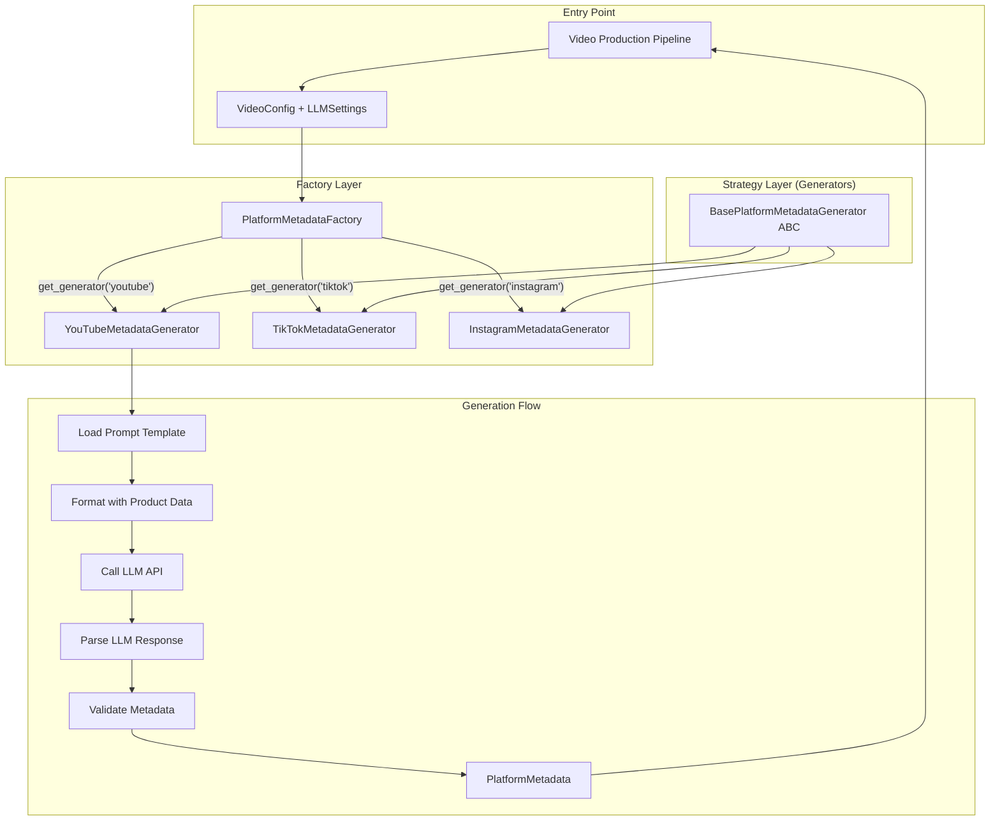

# Design Document: Content Metadata Module

## Overview

The Content Metadata Module generates platform-optimized metadata (titles, descriptions, hashtags, keywords) for YouTube, TikTok, and Instagram using LLM-powered generation. The implementation follows a Factory + Strategy pattern with async LLM integration, enabling extensible platform support while maintaining consistent interfaces.

The design creates:
1. **Platform Generators** (`src/ai/platform_metadata/`) - Strategy pattern implementations per platform
2. **Data Models** (`src/ai/platform_metadata/models.py`) - Pydantic configuration and immutable metadata
3. **Prompt Templates** (`src/ai/prompts/`) - Platform-specific LLM prompts
4. **Pipeline Integration** - Metadata generation integrated into video production

## Architecture

### Module Organization

```
src/ai/platform_metadata/
├── __init__.py                # Package exports and factory
├── base.py                    # BasePlatformMetadataGenerator ABC
├── models.py                  # PlatformMetadata, PlatformMetadataSettings
├── youtube.py                 # YouTubeMetadataGenerator
├── tiktok.py                  # TikTokMetadataGenerator
├── instagram.py               # InstagramMetadataGenerator
├── utilities.py               # Shared parsing and helper functions
└── text_formatter.py          # Text formatting utilities

src/ai/prompts/
├── youtube_metadata.md        # YouTube Shorts prompt template
├── tiktok_metadata.md         # TikTok SEO prompt template
└── instagram_metadata.md      # Instagram Reels prompt template

tests/ai/platform_metadata/
├── __init__.py
├── test_models.py             # Data model tests
├── test_generators.py         # Generator unit tests
├── test_factory.py            # Factory pattern tests
└── test_integration.py        # End-to-end tests
```

### Factory + Strategy Pattern Flow



## Components and Interfaces

### Component 1: BasePlatformMetadataGenerator

- **Purpose:** Abstract base class defining generator interface and shared utilities
- **Location:** `src/ai/platform_metadata/base.py`
- **Interfaces:**
  ```python
  class BasePlatformMetadataGenerator(ABC):
      @abstractmethod
      async def generate(
          self,
          product: ProductData,
          settings: LLMSettings,
          secrets: dict[str, str],
          session: aiohttp.ClientSession,
          intermediate_paths: dict[str, Path],
          debug_mode: bool,
          api_settings=None,
      ) -> PlatformMetadata | None:
          """Generate platform-specific metadata using LLM"""
          pass

      @abstractmethod
      def validate(self, metadata: PlatformMetadata) -> tuple[bool, str]:
          """Validate metadata against platform rules"""
          pass

      @property
      @abstractmethod
      def platform_name(self) -> str:
          """Return platform identifier"""
          pass

      # Protected shared utilities
      def _load_prompt_template(self, template_path: Path) -> str: ...
      def _format_product_prompt(self, template: str, product: ProductData) -> str: ...
      def _truncate_if_needed(self, text: str, max_length: int, label: str) -> str: ...
  ```
- **Dependencies:** aiohttp, description_generator utilities, LLMSettings

### Component 2: Platform-Specific Generators

- **Purpose:** Implement platform-specific metadata generation logic
- **Locations:**
  - `src/ai/platform_metadata/youtube.py`
  - `src/ai/platform_metadata/tiktok.py`
  - `src/ai/platform_metadata/instagram.py`
- **Pattern:** Strategy pattern implementations extending BasePlatformMetadataGenerator
- **Platform-Specific Logic:**
  - **YouTube:** Title optimization (50-60 chars), #Shorts tag, SEO keywords
  - **TikTok:** Caption length (100-300 optimal), avoid generic hashtags
  - **Instagram:** Dual caption styles, extensive hashtags (15-30)

### Component 3: PlatformMetadataFactory

- **Purpose:** Create appropriate generator instances based on platform
- **Location:** `src/ai/platform_metadata/__init__.py`
- **Interfaces:**
  ```python
  class PlatformMetadataFactory:
      @staticmethod
      def get_generator(platform: str) -> BasePlatformMetadataGenerator:
          """Return generator for specified platform"""

      @staticmethod
      def get_all_generators() -> dict[str, BasePlatformMetadataGenerator]:
          """Return all available generators"""

      @staticmethod
      def generate_for_platforms(
          platforms: list[str],
          product: ProductData,
          settings: LLMSettings,
          ...
      ) -> dict[str, PlatformMetadata]:
          """Generate metadata for multiple platforms"""
  ```

### Component 4: Data Models

- **Purpose:** Define configuration and metadata structures
- **Location:** `src/ai/platform_metadata/models.py`
- **Interfaces:**
  ```python
  @dataclass(frozen=True)
  class PlatformMetadata:
      platform: str                    # "youtube", "tiktok", "instagram"
      title: str | None                # YouTube only
      description: str                 # Description/caption
      hashtags: list[str]              # Platform-optimized hashtags
      keywords: list[str]              # SEO keywords
      character_counts: dict[str, int] # {"title": 58, "description": 487}
      generated_at: str                # ISO 8601 timestamp
      product_id: str                  # Product identifier
      validation_status: str           # "valid", "warning", "error"
      validation_messages: list[str]   # Validation details

      def to_dict(self) -> dict: ...
      @classmethod
      def create(cls, ...) -> "PlatformMetadata": ...

  class YouTubePlatformSettings(BaseModel):
      enabled: bool = True
      title_length_max: int = 60
      description_length_max: int = 5000
      hashtag_count_min: int = 3
      hashtag_count_max: int = 5
      include_shorts_tag: bool = True
      seo_keywords: bool = True

  class TikTokPlatformSettings(BaseModel):
      enabled: bool = True
      caption_length_optimal: int = 150
      caption_length_max: int = 2200
      hashtag_count_min: int = 3
      hashtag_count_max: int = 5
      seo_focused: bool = True
      avoid_generic_tags: list[str] = ["foryoupage", "fyp", "viral"]

  class InstagramPlatformSettings(BaseModel):
      enabled: bool = True
      caption_style: str = "seo"        # "short" or "seo"
      caption_length_short: int = 15
      caption_length_seo: int = 200
      hashtag_count_min: int = 15
      hashtag_count_max: int = 30
      emoji_enabled: bool = True

  class PlatformMetadataSettings(BaseModel):
      enabled: bool = True
      target_platform: str = "multi"    # "youtube", "tiktok", "instagram", "multi"
      youtube: YouTubePlatformSettings
      tiktok: TikTokPlatformSettings
      instagram: InstagramPlatformSettings
  ```

## Prompt Template Design

### YouTube Prompt Template

```markdown
# YouTube Shorts Metadata Generator

Generate SEO-optimized metadata for a YouTube Shorts video.

## Product Information
- Name: {FULL_PRODUCT_NAME}
- Description: {PRODUCT_DESCRIPTION}
- Link: {PRODUCT_URL}

## Requirements
1. Title: 50-60 characters, include main keyword, hook viewer
2. Description: Include {PRODUCT_URL}, key features, call-to-action
3. Hashtags: 3-5 including #Shorts and #ad
4. Keywords: 5-10 search-friendly keywords

## Output Format
TITLE: [Your optimized title]
DESCRIPTION: [Your SEO description]
HASHTAGS: #tag1 #tag2 #tag3
KEYWORDS: keyword1, keyword2, keyword3
```

### TikTok Prompt Template

```markdown
# TikTok SEO Caption Generator

Generate SEO-focused caption for TikTok.

## Product Information
- Name: {FULL_PRODUCT_NAME}
- Description: {PRODUCT_DESCRIPTION}
- Link: {PRODUCT_URL}

## Requirements
1. Caption: 100-300 characters, use exact search phrases users might type
2. Hashtags: 3-5 niche-specific (avoid #fyp, #viral, #foryoupage)
3. Include #ad for disclosure

## Output Format
CAPTION: [Your SEO caption]
HASHTAGS: #tag1 #tag2 #tag3
```

### Instagram Prompt Template

```markdown
# Instagram Reels Caption Generator

Generate Reels-optimized caption and hashtags.

## Product Information
- Name: {FULL_PRODUCT_NAME}
- Description: {PRODUCT_DESCRIPTION}
- Link: {PRODUCT_URL}

## Requirements
1. Caption: {CAPTION_STYLE} style - short (3-5 words) or SEO (100-200 chars)
2. Hashtags: 15-30 relevant hashtags for discoverability
3. Include #ad and relevant emojis

## Output Format
CAPTION: [Your caption with emojis]
HASHTAGS: #tag1 #tag2 ... #tag30
```

## Pipeline Integration

### Integration Point: step_generate_description()

The metadata generation integrates into the video production pipeline at the description generation step:

```python
async def step_generate_description(
    video_config: VideoConfig,
    product: ProductData,
    settings: LLMSettings,
    session: aiohttp.ClientSession,
    intermediate_paths: dict[str, Path],
    debug_mode: bool,
) -> tuple[str, dict[str, PlatformMetadata] | None]:
    """Generate description and optional platform-specific metadata."""

    # Generate base description (existing logic)
    description = await generate_description(...)

    # Generate platform-specific metadata if enabled
    platform_metadata = None
    if video_config.platform_metadata.enabled:
        platform_metadata = await PlatformMetadataFactory.generate_for_platforms(
            platforms=get_target_platforms(video_config),
            product=product,
            settings=settings,
            session=session,
            intermediate_paths=intermediate_paths,
            debug_mode=debug_mode,
        )

    return description, platform_metadata
```

## Validation Rules Summary

| Platform  | Field       | Rule                                    |
|-----------|-------------|-----------------------------------------|
| YouTube   | Title       | ≤100 chars (recommended 50-60)          |
| YouTube   | Description | ≤5000 chars                             |
| YouTube   | Hashtags    | 3-5 including #ad, optionally #Shorts   |
| TikTok    | Caption     | ≤2200 chars (optimal 100-300)           |
| TikTok    | Hashtags    | 3-5 niche-specific, avoid generic       |
| Instagram | Caption     | ≤2200 chars (short: 15, SEO: 200)       |
| Instagram | Hashtags    | 15-30 tags                              |
| All       | #ad         | Required for FTC compliance             |

## Error Handling

1. **LLM API Failure**
   - Retry with exponential backoff (max 3 retries)
   - Fallback to unified metadata if platform-specific fails
   - Log detailed error for debugging

2. **Validation Failure**
   - Return metadata with validation_status = "error"
   - Include specific violations in validation_messages
   - Allow caller to decide whether to use or reject

3. **Missing Configuration**
   - Fail fast with clear error message
   - Validate API keys before making calls

4. **Character Limit Exceeded**
   - Truncate with ellipsis
   - Log warning with original and truncated lengths
   - Set validation_status = "warning"

## Testing Strategy

### Unit Testing

**File:** `tests/ai/platform_metadata/test_generators.py`

- Test each generator's generate() method with mocked LLM
- Test validate() with various edge cases
- Test truncation and character counting utilities

### Integration Testing

**File:** `tests/ai/platform_metadata/test_integration.py`

- Test full generation flow with mock LLM API
- Test factory pattern creates correct generators
- Test pipeline integration with video producer

### Validation Testing

**File:** `tests/ai/platform_metadata/test_models.py`

- Test PlatformMetadata creation and serialization
- Test Pydantic settings validation
- Test configuration loading from YAML

## Configuration Schema

```yaml
# config/video.yaml
platform_metadata:
  enabled: true
  target_platform: "multi"  # "youtube", "tiktok", "instagram", "multi"

  youtube:
    enabled: true
    title_length_max: 60
    description_length_max: 5000
    hashtag_count_min: 3
    hashtag_count_max: 5
    include_shorts_tag: true
    seo_keywords: true

  tiktok:
    enabled: true
    caption_length_optimal: 150
    caption_length_max: 2200
    hashtag_count_min: 3
    hashtag_count_max: 5
    seo_focused: true
    avoid_generic_tags:
      - foryoupage
      - fyp
      - viral

  instagram:
    enabled: true
    caption_style: "seo"
    caption_length_short: 15
    caption_length_seo: 200
    hashtag_count_min: 15
    hashtag_count_max: 30
    emoji_enabled: true
```

## Backward Compatibility

- Existing video production workflow unchanged when platform_metadata disabled
- Unified metadata mode preserves current behavior as default
- All existing configurations and arguments preserved
- No breaking changes to CLI interface
