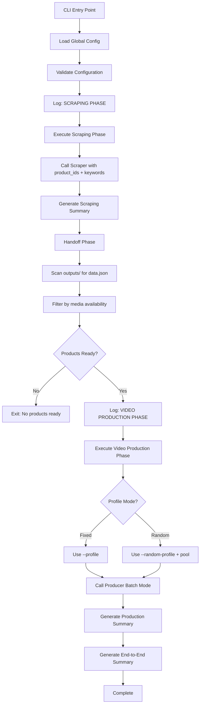

# Design Document

## Overview

The global pipeline batch mode feature creates a new CLI module that orchestrates end-to-end automated content production by sequencing scraper and video producer modules. The implementation follows a minimalist orchestration approach, treating both scraper and producer as black boxes and coordinating their execution with unified configuration and comprehensive reporting.

The design creates:
1. **Pipeline Orchestrator** (`src/pipeline/global_batch.py`) - New module coordinating scraper and producer
2. **Unified Configuration** - Single YAML section and CLI for entire pipeline
3. **Phase Coordinator** - Sequential execution of scraping → handoff → video production
4. **Aggregate Reporting** - Combined statistics across all phases

## Steering Document Alignment

### Technical Standards (tech.md)

**Python Typing**: Modern type hints with `dict[str, Any]`, `list[str]`, `| None`

**Error Handling**: Specific exceptions for phase failures, graceful degradation per product

**Configuration Management**: 3-tier precedence (CLI > YAML > Defaults) applied uniformly

**Logging**: Structured logging with clear phase separation, using existing `setup_debug_logging`

### Project Structure (structure.md)

**New Module Organization**:
```
src/pipeline/
├── __init__.py                # New package
├── __main__.py                # New CLI entry point
├── global_batch.py            # New orchestrator
└── config.py                  # New configuration loading
```

**Separation of Concerns**: Pipeline orchestration separated from scraper and producer implementations

## Code Reuse Analysis

### Existing Components to Leverage

- **BotasaurusAmazonScraper** (`scraper/amazon/scraper.py`): Invoked for scraping phase - zero modifications
- **scraper.main()** or direct scraper instantiation: Scraping phase execution
- **discover_products_for_batch()** (`video/producer/cli.py`): Product discovery for handoff phase
- **Video Producer CLI logic** (`video/producer/cli.py`): Invoked for video production phase
- **VideoConfig** (`video/config.py`): Profile validation and configuration
- **Configuration patterns** - Existing 3-tier precedence from scraper and producer

### Integration Points

- **Scraper Invocation**: Call scraper programmatically with product IDs and keywords
- **Producer Invocation**: Call producer batch mode with discovered products and profile
- **Outputs Directory**: Shared `outputs/` directory for scraper output and producer input
- **Configuration System**: Extend with `global_batch` YAML section
- **Logging System**: Unified logging across both phases with clear headers

## Architecture

### Modular Design Principles

- **Single File Responsibility**: `global_batch.py` orchestrates only; scraper and producer handle execution
- **Component Isolation**: Pipeline treats scraper and producer as black boxes
- **Service Layer Separation**: Configuration, execution, and reporting cleanly separated
- **Utility Modularity**: Phase-specific logic encapsulated in dedicated functions



## Components and Interfaces

### Component 1: Global Pipeline Orchestrator

- **Purpose:** Coordinate scraping and video production phases in sequence
- **Location:** `src/pipeline/global_batch.py`
- **Interfaces:**
  ```python
  class GlobalPipelineOrchestrator:
      def __init__(self, config: GlobalBatchConfig):
          """Initialize orchestrator with unified configuration"""

      async def run_pipeline(self) -> PipelineSummary:
          """Execute complete pipeline: scrape → handoff → produce"""

      async def _execute_scraping_phase(self) -> ScrapingPhaseSummary:
          """Execute scraping phase and return summary"""

      def _execute_handoff_phase(self) -> list[ProductData]:
          """Discover products ready for video production"""

      async def _execute_production_phase(
          self, products: list[ProductData]
      ) -> ProductionPhaseSummary:
          """Execute video production phase and return summary"""

      def _generate_final_summary(
          self, scraping: ScrapingPhaseSummary, production: ProductionPhaseSummary
      ) -> PipelineSummary:
          """Generate end-to-end pipeline summary"""
  ```
- **Dependencies:** Scraper, Producer, logging
- **Reuses:** BotasaurusAmazonScraper, discover_products_for_batch(), video producer batch logic

### Component 2: Configuration Management

- **Purpose:** Load and validate unified pipeline configuration
- **Location:** `src/pipeline/config.py`
- **Interfaces:**
  ```python
  def load_global_batch_config(
      cli_args: argparse.Namespace
  ) -> GlobalBatchConfig:
      """Load configuration with CLI > YAML > defaults precedence"""

  def validate_global_batch_config(config: GlobalBatchConfig) -> None:
      """Validate configuration before pipeline starts

      Raises:
          ValueError: If validation fails (no inputs, invalid profiles, etc.)
      """
  ```
- **Dependencies:** argparse, YAML loader, VideoConfig
- **Reuses:** Existing configuration patterns from scraper and producer

### Component 3: CLI Entry Point

- **Purpose:** Provide command-line interface for global batch pipeline
- **Location:** `src/pipeline/__main__.py`
- **Interfaces:**
  ```python
  def main():
      """CLI entry point for global batch pipeline

      Usage:
          python -m src.pipeline.global_batch --product-ids ASIN1 ASIN2 --profile slideshow_images1
      """
  ```
- **Dependencies:** argparse, GlobalPipelineOrchestrator
- **Reuses:** Argument parsing patterns from scraper and producer

### Component 4: Summary Reporting

- **Purpose:** Generate comprehensive statistics across all pipeline phases
- **Location:** `src/pipeline/global_batch.py` (part of orchestrator)
- **Interfaces:**
  ```python
  class PipelineSummary:
      """End-to-end pipeline summary statistics"""

      scraping_summary: ScrapingPhaseSummary
      production_summary: ProductionPhaseSummary
      end_to_end_success: int          # Scraped AND produced
      partial_success: int              # Scraped but not produced
      total_failures: int               # Failed in either phase
      total_duration_sec: float

      def format(self) -> str:
          """Format summary as readable report"""
  ```
- **Dependencies:** None (data class)
- **Reuses:** Summary formatting patterns from scraper and producer

## Data Models

### GlobalBatchConfig

```python
from dataclasses import dataclass

@dataclass
class GlobalBatchConfig:
    """Unified configuration for global batch pipeline"""
    # Scraper configuration
    product_ids: list[str]
    keywords: list[str]
    max_products: int
    scraper_filters: ScraperFilters

    # Producer configuration
    profile: str | None
    random_profile: bool
    profile_pool: list[str]

    # Common configuration
    fail_fast: bool
    outputs_dir: Path
    debug: bool
```

### ScrapingPhaseSummary

```python
@dataclass
class ScrapingPhaseSummary:
    """Scraping phase statistics"""
    total_attempted: int
    successful: int
    failed: int
    failed_products: list[str]
    media_stats: dict[str, int]      # e.g., {"total_images": 45, "total_videos": 12}
    duration_sec: float
```

### ProductionPhaseSummary

```python
@dataclass
class ProductionPhaseSummary:
    """Video production phase statistics"""
    total_attempted: int
    successful: int
    failed: int
    skipped: int
    failed_products: list[str]
    skipped_products: list[str]
    profile_distribution: dict[str, int] | None  # Only if randomization enabled
    duration_sec: float
```

### PipelineSummary

```python
@dataclass
class PipelineSummary:
    """End-to-end pipeline statistics"""
    scraping: ScrapingPhaseSummary
    production: ProductionPhaseSummary
    end_to_end_success: int          # Scraped AND produced successfully
    partial_success: int              # Scraped successfully but not produced
    total_failures: int               # Failed scraping or production
    total_duration_sec: float
```

## Error Handling

### Error Scenarios

1. **No Input Provided (No Product IDs or Keywords)**
   - **Handling:** Raise `ValueError` at configuration validation
   - **User Impact:** Immediate error before any processing: "No product IDs or keywords provided"

2. **Invalid Profile in Configuration**
   - **Handling:** Raise `ValueError` at configuration validation
   - **User Impact:** Immediate error: "Invalid profile: {profile}. Available: {available_profiles}"

3. **Scraping Phase Failure with Fail-Fast**
   - **Handling:** Stop pipeline immediately, skip video production phase
   - **User Impact:** See scraping summary only, clear message "Pipeline stopped due to scraping failure"

4. **No Products Ready After Scraping**
   - **Handling:** Exit gracefully after handoff phase
   - **User Impact:** See scraping summary, message "No products with sufficient media for video production"

5. **Video Production Failure with Fail-Fast**
   - **Handling:** Stop pipeline immediately
   - **User Impact:** See partial production summary, message "Pipeline stopped due to video production failure"

6. **Partial Pipeline Success**
   - **Handling:** Generate complete summary showing successes and failures
   - **User Impact:** See detailed breakdown: scraped successfully, produced successfully, failed at each stage

## Testing Strategy

### Unit Testing

**File:** `tests/pipeline/test_global_batch_orchestrator.py`

- **Test Configuration Loading**:
  - CLI override of YAML configuration
  - YAML configuration fallback
  - Validation catches missing inputs
  - Validation catches invalid profiles

- **Test Phase Coordination**:
  - Scraping phase executes before production
  - Handoff phase filters products correctly
  - Production phase receives filtered products
  - Fail-fast stops between phases

- **Test Summary Generation**:
  - Scraping summary accuracy
  - Production summary accuracy
  - End-to-end statistics calculation
  - Summary formatting

### Integration Testing

**File:** `tests/pipeline/test_global_batch_integration.py`

- **Test End-to-End Pipeline**:
  - Complete flow: scrape → handoff → produce
  - Product IDs input mode
  - Keywords input mode
  - Mixed input mode (product IDs + keywords)
  - Profile randomization across pipeline

- **Test Configuration Precedence**:
  - CLI overrides YAML for all settings
  - YAML used when no CLI override
  - Configuration validation before execution

- **Test Error Handling**:
  - Fail-fast at scraping phase
  - Fail-fast at production phase
  - Graceful continuation mode
  - Partial success scenarios

### End-to-End Testing

**Manual Test Scenarios:**

1. **Complete Pipeline with Product IDs**:
   ```bash
   poetry run python -m src.pipeline.global_batch --product-ids B0ASIN1 B0ASIN2 --profile slideshow_images1 --debug
   ```
   - Verify: Both products scraped and videos produced

2. **Keywords with Random Profiles**:
   ```bash
   poetry run python -m src.pipeline.global_batch --keywords "wireless earbuds" --max-products 5 --random-profile --debug
   ```
   - Verify: Products discovered, scraped, videos produced with random profiles

3. **Fail-Fast Behavior**:
   ```bash
   poetry run python -m src.pipeline.global_batch --product-ids INVALID --keywords "test" --fail-fast --debug
   ```
   - Verify: Pipeline stops after scraping phase failure

4. **YAML Configuration**:
   - Configure `global_batch` section in YAML
   - Run without CLI arguments
   - Verify: YAML configuration used

## Implementation Notes

### CLI Entry Point

**New command:**
```bash
python -m src.pipeline.global_batch [args]
```

**Arguments:**
- All scraper arguments: `--product-ids`, `--keywords`, `--max-products`, filters
- All producer arguments: `--profile`, `--random-profile`, `--profile-pool`
- Common arguments: `--fail-fast`, `--outputs-dir`, `--debug`

### YAML Schema Extension

**New section in configuration file (e.g., `config/pipeline.yaml` or extend existing):**
```yaml
global_batch:
  enabled: false
  scraper:
    product_ids: []
    keywords: []
    max_products: 10
    filters:
      min_price: 0
      max_price: 1000
      min_rating: 4.0
      prime_only: false
  video:
    profile: slideshow_images1
    random_profile: false
    profile_pool: []
    fail_fast: false
```

### Scraper Invocation

```python
# Programmatic scraper invocation
from src.scraper.amazon.scraper import BotasaurusAmazonScraper
from src.scraper.amazon.models import SearchParameters

scraper = BotasaurusAmazonScraper()
search_params = SearchParameters(...)
products = scraper.scrape_products(keywords=config.keywords, search_params=search_params)
```

### Producer Invocation

```python
# Use existing batch mode functionality
from src.video.producer.cli import discover_products_for_batch
from src.video.producer.orchestration import create_video_for_product

products = discover_products_for_batch(outputs_dir)
for product_dir, product_data in products:
    # Call video production for each product
    await create_video_for_product(...)
```

### Backward Compatibility

- Existing scraper CLI unchanged (`python -m src.scraper.amazon.scraper`)
- Existing producer CLI unchanged (`python -m src.video.producer`)
- New global batch CLI is additive, doesn't modify existing modules
- All existing configurations and arguments preserved
