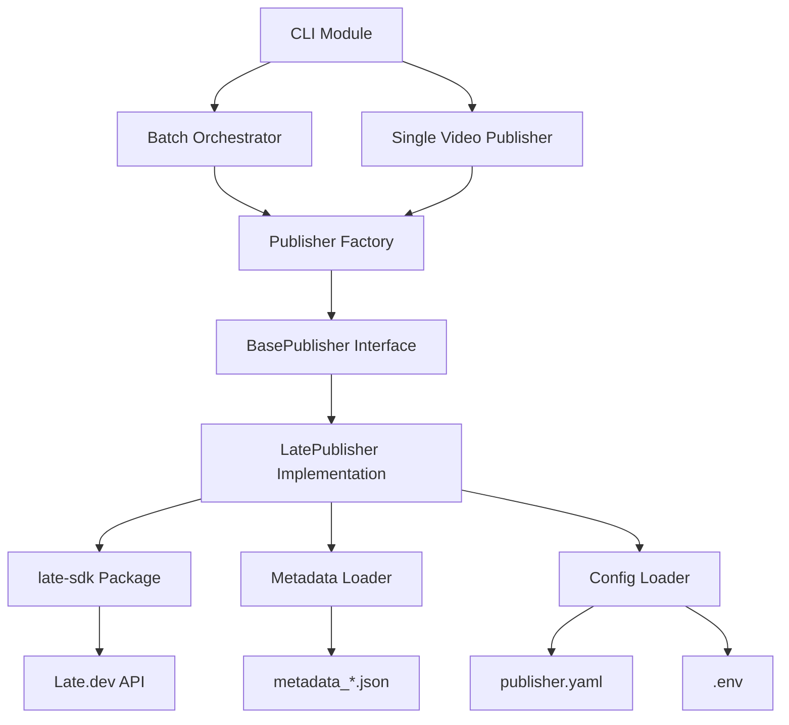

# Design Document

## Overview

The Late Publisher module integrates Late.dev's multi-platform scheduling service into ContentEngineAI's video production pipeline. This feature enables automated video publishing to YouTube, TikTok, and Instagram through a unified API, completing the end-to-end workflow from product scraping to live social media posts.

**Architecture Pattern**: Provider-based abstraction following the existing `BaseURLShortener` pattern, allowing future integration of alternative scheduling services (Buffer, Hootsuite, etc.) without modifying core publishing logic.

**Integration Point**: Post-production phase after video assembly and metadata generation, operating on completed video files in `outputs/{product_id}/` directories.

## Steering Document Alignment

### Technical Standards (tech.md)

**Async-First Python CLI**: Late publisher follows ContentEngineAI's async architecture using `aiohttp` for all API calls with the Late Python SDK's async methods (`acreate`, `aupload`, `alist`).

**Provider Fallback Pattern**: Implements multi-level abstraction (BasePublisher → LatePublisher) enabling future provider switching and fallback chains, consistent with TTS/STT/LLM provider patterns.

**Configuration System**: Three-tier precedence (CLI > env > YAML) matches existing configuration architecture, with Late credentials stored in `.env` and defaults in `config/publisher.yaml`.

**Dependency Management**: Uses Poetry for package management, adding `late-sdk` to pyproject.toml dependencies.

### Project Structure (structure.md)

**Modular Organization**:
```
src/publisher/
├── __init__.py           # Package exports
├── base.py               # BasePublisher abstract interface
├── late/
│   ├── __init__.py       # Late provider exports
│   ├── client.py         # LatePublisher implementation
│   ├── models.py         # Late-specific data models
│   └── __main__.py       # CLI entry point
├── config.py             # Configuration loading
├── metadata.py           # Metadata file loading
├── batch.py              # Batch publishing orchestrator
└── registry.py           # Publisher provider registry
```

**Configuration**:
```
config/
└── publisher.yaml        # Publisher settings (providers, defaults, retry config)
```

**Testing**:
```
tests/publisher/
├── test_late_client.py          # Unit tests for Late client
├── test_batch_publisher.py      # Batch orchestration tests
├── test_metadata_loader.py      # Metadata loading tests
└── test_publisher_integration.py # End-to-end integration tests
```

## Code Reuse Analysis

### Existing Components to Leverage

- **`src/utils/url_shortener/base.py`**: Provider pattern template (BaseURLShortener → BasePublisher)
- **`src/utils/url_shortener/registry.py`**: Registry and factory pattern for provider management
- **`src/pipeline/global_batch.py`**: Batch orchestration pattern with progress tracking
- **`src/video/producer/cli.py`**: CLI argument parsing structure using argparse
- **`src/utils/async_io.py`**: Async utilities for file streaming and chunked uploads
- **`src/utils/circuit_breaker.py`**: Circuit breaker for API failure detection
- **`src/utils/connection_pool.py`**: aiohttp session pooling for HTTP reuse
- **`src/ai/platform_metadata/base.py`**: Abstract base class pattern with async generation
- **`src/video/config_adapter.py`**: Configuration loading with three-tier precedence
- **`src/utils/logging_setup.py`**: Structured logging configuration

### Integration Points

- **Platform Metadata System (v0.17.0)**: Load platform-optimized metadata from `outputs/{product_id}/text/metadata_{platform}.json`
- **Video Assembly Output**: Publish final videos from `outputs/{product_id}/video_*.mp4`
- **Batch Pipeline**: Integrate with global batch pipeline for scrape → generate → publish workflow
- **Configuration System**: Extend modular YAML config in `config/publisher.yaml`
- **CLI Interface**: Add publisher CLI module at `python -m src.publisher.late`

### Integration Patterns

- **Post-Production Hook**: Optional publisher invocation after video assembly completion
- **Batch Extension**: Add `--publish` flag to global batch pipeline for automatic publishing
- **Metadata Coupling**: Read JSON metadata files generated by platform metadata system
- **Output Directory Scanning**: Discover publishable videos using existing outputs directory structure

## Architecture

The Late Publisher follows a **Provider-Based Architecture** with three layers:

1. **Abstract Interface Layer** (`base.py`): Defines `BasePublisher` contract
2. **Provider Implementation Layer** (`late/client.py`): Late-specific implementation
3. **Orchestration Layer** (`batch.py`): Batch processing with progress tracking



### Modular Design Principles

- **Single File Responsibility**: Each file handles one domain (client, batch, config, metadata, models)
- **Component Isolation**: Late client isolated in `src/publisher/late/` for easy replacement
- **Service Layer Separation**: Data access (metadata), business logic (publishing), orchestration (batch)
- **Utility Modularity**: Reuse existing async_io, connection_pool, circuit_breaker utilities

## Components and Interfaces

### Component 1: BasePublisher (Abstract Interface)

**Purpose**: Define common interface for all publishing service providers

**File**: `src/publisher/base.py`

**Interfaces**:
```python
from abc import ABC, abstractmethod
from enum import Enum
from dataclasses import dataclass

class PublisherProvider(Enum):
    LATE = "late"
    BUFFER = "buffer"  # Future
    HOOTSUITE = "hootsuite"  # Future

@dataclass
class PublishResult:
    success: bool
    post_id: str | None
    platform: str
    scheduled_time: datetime | None
    published_url: str | None
    error_message: str | None

class BasePublisher(ABC):
    @abstractmethod
    async def authenticate(self) -> bool:
        """Validate API credentials."""
        pass

    @abstractmethod
    async def get_accounts(self) -> list[dict]:
        """List connected social media accounts."""
        pass

    @abstractmethod
    async def upload_media(self, video_path: Path) -> str:
        """Upload video file and return media ID."""
        pass

    @abstractmethod
    async def publish(
        self,
        media_id: str,
        platforms: list[dict],
        content: str,
        scheduled_time: datetime | None = None,
    ) -> PublishResult:
        """Publish content to specified platforms."""
        pass

    @abstractmethod
    async def get_status(self, post_id: str) -> dict:
        """Check publish status and retrieve post URLs."""
        pass
```

**Dependencies**: None (abstract interface)

**Reuses**: Provider pattern from `src/utils/url_shortener/base.py`

### Component 2: LatePublisher (Late.dev Implementation)

**Purpose**: Implement Late-specific publishing logic using late-sdk

**File**: `src/publisher/late/client.py`

**Interfaces**:
```python
from late import Late, Platform
from late.client.exceptions import (
    LateAPIError,
    LateAuthenticationError,
    LateRateLimitError,
    LateNotFoundError,
)

class LatePublisher(BasePublisher):
    def __init__(
        self,
        api_key: str,
        vercel_token: str | None = None,
        session: aiohttp.ClientSession | None = None,
        timeout: float = 30.0,
        max_retries: int = 3,
    ):
        self.client = Late(
            api_key=api_key,
            timeout=timeout,
            max_retries=max_retries,
        )
        self.vercel_token = vercel_token
        self._session = session or aiohttp.ClientSession()

    async def authenticate(self) -> bool:
        """Validate Late API key by fetching accounts."""
        try:
            accounts = await self.client.accounts.alist()
            return len(accounts) >= 0  # Any response means auth works
        except LateAuthenticationError:
            return False

    async def get_accounts(self) -> list[dict]:
        """Fetch connected accounts from Late."""
        accounts = await self.client.accounts.alist()
        return [
            {
                "account_id": acc.id,
                "platform": acc.platform,
                "username": acc.username,
            }
            for acc in accounts
        ]

    async def upload_media(self, video_path: Path) -> str:
        """Upload video to Late based on file size."""
        file_size = video_path.stat().st_size
        max_small_file_mb = 4
        max_small_file_bytes = max_small_file_mb * 1024 * 1024

        if file_size <= max_small_file_bytes:
            result = await self.client.media.aupload(str(video_path))
        elif self.vercel_token:
            result = await self.client.media.aupload_large(
                str(video_path),
                vercel_token=self.vercel_token,
            )
        else:
            raise ValueError(
                f"Video {file_size / 1024 / 1024:.1f}MB exceeds 4MB limit. "
                "Provide LATE_VERCEL_TOKEN for large uploads."
            )

        return result.media_id

    async def publish(
        self,
        media_id: str,
        platforms: list[dict],
        content: str,
        scheduled_time: datetime | None = None,
    ) -> PublishResult:
        """Create post on Late with specified platforms."""
        platform_objects = [
            {
                "platform": Platform(p["platform"]),
                "accountId": p["account_id"],
            }
            for p in platforms
        ]

        try:
            post = await self.client.posts.acreate(
                content=content,
                platforms=platform_objects,
                media=[media_id],
                scheduled_for=scheduled_time,
                publish_now=(scheduled_time is None),
            )

            return PublishResult(
                success=True,
                post_id=post.id,
                platform=", ".join(p["platform"] for p in platforms),
                scheduled_time=scheduled_time,
                published_url=post.url if hasattr(post, "url") else None,
                error_message=None,
            )
        except LateAPIError as e:
            return PublishResult(
                success=False,
                post_id=None,
                platform=", ".join(p["platform"] for p in platforms),
                scheduled_time=None,
                published_url=None,
                error_message=str(e),
            )
```

**Dependencies**: `late-sdk`, `aiohttp`

**Reuses**: Async patterns from `src/ai/platform_metadata/base.py`, circuit breaker from `src/utils/circuit_breaker.py`

### Component 3: Metadata Loader

**Purpose**: Load platform-specific metadata from JSON files

**File**: `src/publisher/metadata.py`

**Interfaces**:
```python
from pathlib import Path
import json

@dataclass
class PublishMetadata:
    platform: str
    title: str
    description: str
    hashtags: list[str]
    privacy: str

def load_platform_metadata(
    product_dir: Path,
    platform: str,
) -> PublishMetadata:
    """Load metadata from outputs/{product_id}/text/metadata_{platform}.json."""
    metadata_file = product_dir / "text" / f"metadata_{platform}.json"

    if not metadata_file.exists():
        # Fallback to UPLOAD_INSTRUCTIONS.txt parsing
        instructions_file = product_dir / "text" / "UPLOAD_INSTRUCTIONS.txt"
        if instructions_file.exists():
            return parse_upload_instructions(instructions_file, platform)
        raise FileNotFoundError(
            f"Metadata not found for {platform} at {metadata_file}"
        )

    with open(metadata_file, "r", encoding="utf-8") as f:
        data = json.load(f)

    return PublishMetadata(
        platform=platform,
        title=data.get("title", ""),
        description=data.get("description", ""),
        hashtags=data.get("hashtags", []),
        privacy=data.get("privacy", "public"),
    )

def format_post_content(metadata: PublishMetadata) -> str:
    """Format metadata into post content string."""
    parts = []

    if metadata.description:
        parts.append(metadata.description)

    if metadata.hashtags:
        parts.append(" ".join(metadata.hashtags))

    return "\n\n".join(parts)
```

**Dependencies**: `pathlib`, `json`

**Reuses**: Output directory structure from `src/utils/outputs_paths.py`

### Component 4: Publisher Configuration

**Purpose**: Load publisher settings from YAML, environment variables, and CLI args

**File**: `src/publisher/config.py`

**Interfaces**:
```python
from dataclasses import dataclass
from pathlib import Path
import yaml
import os

@dataclass
class PublisherConfig:
    enabled: bool
    provider: str
    default_platforms: list[str]
    schedule_mode: str
    default_privacy: str
    retry_attempts: int
    retry_backoff_multiplier: float
    upload_timeout_sec: int
    api_key: str
    vercel_token: str | None
    platform_accounts: dict[str, str]  # platform -> account_id

def load_publisher_config(
    config_path: Path = Path("config/publisher.yaml"),
    cli_overrides: dict | None = None,
) -> PublisherConfig:
    """Load publisher configuration with three-tier precedence."""
    # 1. Load YAML defaults
    with open(config_path, "r") as f:
        yaml_config = yaml.safe_load(f).get("publisher", {})

    # 2. Override with environment variables
    api_key = os.getenv("LATE_API_KEY", yaml_config.get("api_key", ""))
    vercel_token = os.getenv("LATE_VERCEL_TOKEN")

    # 3. Override with CLI arguments
    cli = cli_overrides or {}

    return PublisherConfig(
        enabled=yaml_config.get("enabled", True),
        provider=yaml_config.get("provider", "late"),
        default_platforms=cli.get("platforms") or yaml_config.get("default_platforms", ["youtube"]),
        schedule_mode=cli.get("schedule_mode") or yaml_config.get("schedule_mode", "immediate"),
        default_privacy=cli.get("privacy") or yaml_config.get("default_privacy", "public"),
        retry_attempts=yaml_config.get("retry_attempts", 3),
        retry_backoff_multiplier=yaml_config.get("retry_backoff_multiplier", 2.0),
        upload_timeout_sec=cli.get("upload_timeout") or yaml_config.get("upload_timeout_sec", 1800),
        api_key=api_key,
        vercel_token=vercel_token,
        platform_accounts=yaml_config.get("platform_accounts", {}),
    )
```

**Dependencies**: `pyyaml`, `os`, `pathlib`

**Reuses**: Configuration loading pattern from `src/video/config_adapter.py`

### Component 5: Batch Publisher Orchestrator

**Purpose**: Orchestrate batch publishing with progress tracking and error handling

**File**: `src/publisher/batch.py`

**Interfaces**:
```python
from dataclasses import dataclass
import asyncio
import random

@dataclass
class BatchPublishSummary:
    total_videos: int
    successful: int
    failed: int
    skipped: int
    published_urls: dict[str, list[str]]  # product_id -> [urls]
    failed_products: list[str]

class BatchPublisher:
    def __init__(
        self,
        publisher: BasePublisher,
        config: PublisherConfig,
        outputs_dir: Path = Path("outputs"),
    ):
        self.publisher = publisher
        self.config = config
        self.outputs_dir = outputs_dir

    async def discover_videos(self) -> list[tuple[Path, Path]]:
        """Scan outputs directory for videos with metadata."""
        videos = []

        for product_dir in self.outputs_dir.iterdir():
            if not product_dir.is_dir():
                continue

            # Find video file
            video_files = list(product_dir.glob("video_*.mp4"))
            if not video_files:
                continue

            video_file = video_files[0]

            # Check metadata exists for target platforms
            metadata_dir = product_dir / "text"
            has_metadata = any(
                (metadata_dir / f"metadata_{platform}.json").exists()
                for platform in self.config.default_platforms
            )

            if has_metadata:
                videos.append((product_dir, video_file))

        return videos

    async def publish_batch(
        self,
        fail_fast: bool = False,
    ) -> BatchPublishSummary:
        """Publish all discovered videos in batch."""
        videos = await self.discover_videos()

        if not videos:
            logger.info("No videos with metadata found for publishing")
            return BatchPublishSummary(0, 0, 0, 0, {}, [])

        logger.info(f"Found {len(videos)} videos to publish")

        summary = BatchPublishSummary(
            total_videos=len(videos),
            successful=0,
            failed=0,
            skipped=0,
            published_urls={},
            failed_products=[],
        )

        for idx, (product_dir, video_file) in enumerate(videos, 1):
            product_id = product_dir.name
            logger.info(f"[{idx}/{len(videos)}] Publishing {product_id}")

            try:
                result = await self.publish_single(product_dir, video_file)

                if result.success:
                    summary.successful += 1
                    if result.published_url:
                        summary.published_urls[product_id] = [result.published_url]
                else:
                    summary.failed += 1
                    summary.failed_products.append(product_id)
                    logger.error(f"Failed to publish {product_id}: {result.error_message}")

                    if fail_fast:
                        break
            except Exception as e:
                logger.exception(f"Exception publishing {product_id}: {e}")
                summary.failed += 1
                summary.failed_products.append(product_id)

                if fail_fast:
                    break

            # Staggered delay between posts
            if idx < len(videos):
                delay = random.uniform(30, 60)
                await asyncio.sleep(delay)

        return summary

    async def publish_single(
        self,
        product_dir: Path,
        video_file: Path,
    ) -> PublishResult:
        """Publish single video with platform-specific metadata."""
        # Upload media
        media_id = await self.publisher.upload_media(video_file)

        # Load metadata for target platforms
        platforms_data = []
        content_parts = []

        for platform in self.config.default_platforms:
            metadata = load_platform_metadata(product_dir, platform)
            content_parts.append(format_post_content(metadata))

            account_id = self.config.platform_accounts.get(platform)
            if not account_id:
                logger.warning(f"No account ID configured for {platform}, skipping")
                continue

            platforms_data.append({
                "platform": platform,
                "account_id": account_id,
            })

        if not platforms_data:
            raise ValueError("No valid platforms configured for publishing")

        # Use first platform's content (they should be similar)
        content = content_parts[0] if content_parts else ""

        # Publish
        result = await self.publisher.publish(
            media_id=media_id,
            platforms=platforms_data,
            content=content,
            scheduled_time=None,  # Immediate by default
        )

        return result
```

**Dependencies**: `asyncio`, `random`, `pathlib`

**Reuses**: Batch orchestration pattern from `src/pipeline/global_batch.py`

### Component 6: CLI Module

**Purpose**: Command-line interface for publisher operations

**File**: `src/publisher/late/__main__.py`

**Interfaces**:
```python
import argparse
import asyncio
from pathlib import Path

def create_argument_parser():
    parser = argparse.ArgumentParser(
        description="Late Publisher - Publish videos to social media platforms",
        formatter_class=argparse.RawDescriptionHelpFormatter,
        epilog="""
Examples:
  # Publish single video to YouTube
  python -m src.publisher.late --video outputs/B0ABC123/video_product.mp4 --platform youtube

  # Publish to multiple platforms with schedule
  python -m src.publisher.late --video outputs/B0ABC123/video_product.mp4 \\
      --platform youtube tiktok instagram --schedule "2025-12-20 14:00:00"

  # Batch publish all videos
  python -m src.publisher.late --batch --outputs-dir outputs --platform youtube
        """,
    )

    parser.add_argument("--video", type=Path, help="Path to video file")
    parser.add_argument("--platform", nargs="+", choices=["youtube", "tiktok", "instagram"])
    parser.add_argument("--schedule", help="Schedule datetime (YYYY-MM-DD HH:MM:SS)")
    parser.add_argument("--batch", action="store_true", help="Batch publish all videos")
    parser.add_argument("--outputs-dir", type=Path, default=Path("outputs"))
    parser.add_argument("--fail-fast", action="store_true")
    parser.add_argument("--debug", action="store_true")

    return parser

async def main():
    parser = create_argument_parser()
    args = parser.parse_args()

    # Load configuration
    config = load_publisher_config(cli_overrides={
        "platforms": args.platform,
        "schedule_mode": "scheduled" if args.schedule else "immediate",
    })

    # Create publisher
    publisher = create_publisher(
        provider=config.provider,
        api_key=config.api_key,
        vercel_token=config.vercel_token,
    )

    if args.batch:
        # Batch publishing
        batch = BatchPublisher(publisher, config, args.outputs_dir)
        summary = await batch.publish_batch(fail_fast=args.fail_fast)
        print(f"Batch Summary: {summary.successful}/{summary.total_videos} published")
    else:
        # Single video publishing
        if not args.video:
            parser.error("--video required for single publish")

        # Implementation of single publish...
        pass

if __name__ == "__main__":
    asyncio.run(main())
```

**Dependencies**: `argparse`, `asyncio`, `pathlib`

**Reuses**: CLI structure from `src/pipeline/global_batch.py`

## Data Models

### PublishResult
```python
@dataclass
class PublishResult:
    success: bool                    # Whether publish succeeded
    post_id: str | None              # Late post ID
    platform: str                    # Platform(s) published to
    scheduled_time: datetime | None  # Scheduled publish time
    published_url: str | None        # Live post URL (if immediate)
    error_message: str | None        # Error details if failed
```

### PublishMetadata
```python
@dataclass
class PublishMetadata:
    platform: str          # youtube | tiktok | instagram
    title: str             # Platform-optimized title
    description: str       # Platform-optimized description
    hashtags: list[str]    # Platform-optimized hashtags
    privacy: str           # public | unlisted | private
```

### PublisherConfig
```python
@dataclass
class PublisherConfig:
    enabled: bool                         # Master enable/disable
    provider: str                         # late | buffer | hootsuite
    default_platforms: list[str]          # Default target platforms
    schedule_mode: str                    # immediate | scheduled
    default_privacy: str                  # public | unlisted | private
    retry_attempts: int                   # Max retry count
    retry_backoff_multiplier: float       # Exponential backoff multiplier
    upload_timeout_sec: int               # Upload timeout
    api_key: str                          # Late API key from env
    vercel_token: str | None              # Vercel token for large uploads
    platform_accounts: dict[str, str]     # platform -> account_id mapping
```

### BatchPublishSummary
```python
@dataclass
class BatchPublishSummary:
    total_videos: int                      # Total videos attempted
    successful: int                        # Successfully published
    failed: int                            # Failed to publish
    skipped: int                           # Skipped (no metadata)
    published_urls: dict[str, list[str]]   # product_id -> URLs
    failed_products: list[str]             # Failed product IDs
```

## Error Handling

### Error Scenarios

1. **Authentication Failure (401)**
   - **Handling**: Raise `LateAuthenticationError` with clear message about invalid/expired API key
   - **User Impact**: "Late API authentication failed. Check LATE_API_KEY in .env file."
   - **Recovery**: Update `.env` with valid API key, retry

2. **Rate Limit Exceeded (429)**
   - **Handling**: Extract `retry-after` header, wait specified duration, retry up to max_retries
   - **User Impact**: "Rate limited by Late API. Waiting 60 seconds before retry..."
   - **Recovery**: Automatic exponential backoff with configurable max retries

3. **File Size Exceeded (>500 MB)**
   - **Handling**: Validate file size before upload, raise `ValueError` if exceeds Late's 500MB limit
   - **User Impact**: "Video exceeds 500MB limit. Late.dev maximum is 500MB."
   - **Recovery**: Re-encode video at lower bitrate or shorter duration

4. **Missing Metadata Files**
   - **Handling**: Check metadata file existence, fall back to UPLOAD_INSTRUCTIONS.txt parsing
   - **User Impact**: "Metadata not found for YouTube at outputs/B0ABC123/text/metadata_youtube.json"
   - **Recovery**: Run platform metadata generation before publishing

5. **Network Timeout**
   - **Handling**: Use configurable `upload_timeout_sec`, retry with exponential backoff
   - **User Impact**: "Upload timeout after 1800 seconds. Retrying (attempt 2/3)..."
   - **Recovery**: Automatic retry with increased timeout on each attempt

6. **Missing Account Configuration**
   - **Handling**: Validate account IDs exist for target platforms before upload
   - **User Impact**: "No account ID configured for platform 'instagram'. Update config/publisher.yaml"
   - **Recovery**: Connect accounts on Late.dev, update platform_accounts in config

7. **Partial Multi-Platform Failure**
   - **Handling**: Continue publishing to remaining platforms, log specific platform errors
   - **User Impact**: "Published to YouTube, failed for TikTok: Invalid video format"
   - **Recovery**: Review platform-specific requirements, retry failed platform individually

## Testing Strategy

### Unit Testing

**Test Coverage**:
- `test_late_client.py`: LatePublisher methods with mocked late-sdk responses
- `test_metadata_loader.py`: Metadata loading from JSON files and fallback parsing
- `test_config_loader.py`: Configuration precedence (CLI > env > YAML)
- `test_publisher_factory.py`: Registry and factory pattern for providers

**Key Test Cases**:
```python
@pytest.mark.asyncio
async def test_late_upload_small_file(mock_late_client):
    """Test upload for files ≤4MB using direct upload."""
    publisher = LatePublisher(api_key="test_key")
    mock_late_client.media.aupload.return_value = Mock(media_id="media_123")

    video_path = Path("/tmp/test_video.mp4")
    video_path.write_bytes(b"0" * (3 * 1024 * 1024))  # 3MB file

    media_id = await publisher.upload_media(video_path)

    assert media_id == "media_123"
    mock_late_client.media.aupload.assert_called_once()

@pytest.mark.asyncio
async def test_late_upload_large_file_without_vercel_token():
    """Test upload fails for large files without Vercel token."""
    publisher = LatePublisher(api_key="test_key", vercel_token=None)

    video_path = Path("/tmp/large_video.mp4")
    video_path.write_bytes(b"0" * (10 * 1024 * 1024))  # 10MB file

    with pytest.raises(ValueError, match="exceeds 4MB limit"):
        await publisher.upload_media(video_path)

def test_config_precedence():
    """Test CLI args override env vars override YAML."""
    os.environ["LATE_API_KEY"] = "env_key"

    config = load_publisher_config(cli_overrides={"platforms": ["youtube"]})

    assert config.api_key == "env_key"  # From env
    assert config.default_platforms == ["youtube"]  # From CLI
    assert config.retry_attempts == 3  # From YAML default

def test_metadata_fallback():
    """Test fallback to UPLOAD_INSTRUCTIONS.txt when metadata missing."""
    product_dir = Path("/tmp/test_product")
    (product_dir / "text").mkdir(parents=True)

    # Create UPLOAD_INSTRUCTIONS.txt
    instructions = product_dir / "text" / "UPLOAD_INSTRUCTIONS.txt"
    instructions.write_text("YouTube Title: Test Product\nDescription: Test desc")

    metadata = load_platform_metadata(product_dir, "youtube")

    assert metadata.title == "Test Product"
    assert "Test desc" in metadata.description
```

### Integration Testing

**Test Coverage**:
- `test_publisher_integration.py`: End-to-end publishing flow with real Late API (sandboxed)
- `test_batch_publisher_integration.py`: Batch publishing with multiple videos
- `test_metadata_integration.py`: Load metadata from actual platform metadata system output

**Key Integration Tests**:
```python
@pytest.mark.integration
@pytest.mark.asyncio
async def test_end_to_end_publish_flow():
    """Test complete flow: load config → authenticate → upload → publish."""
    config = load_publisher_config()
    publisher = create_publisher("late", api_key=os.getenv("LATE_API_KEY_TEST"))

    # Authenticate
    assert await publisher.authenticate()

    # Get accounts
    accounts = await publisher.get_accounts()
    assert len(accounts) > 0

    # Upload media
    test_video = Path("tests/fixtures/test_video.mp4")
    media_id = await publisher.upload_media(test_video)
    assert media_id

    # Publish
    result = await publisher.publish(
        media_id=media_id,
        platforms=[{"platform": "youtube", "account_id": accounts[0]["account_id"]}],
        content="Test post from integration test",
    )

    assert result.success
    assert result.post_id

@pytest.mark.integration
@pytest.mark.asyncio
async def test_batch_publisher_discovers_videos():
    """Test batch orchestrator discovers videos with metadata."""
    # Setup test outputs directory
    outputs_dir = Path("/tmp/test_outputs")
    setup_test_videos_with_metadata(outputs_dir)

    config = PublisherConfig(...)
    publisher = create_publisher("late", api_key="test")
    batch = BatchPublisher(publisher, config, outputs_dir)

    videos = await batch.discover_videos()

    assert len(videos) == 3  # Expected test videos
    assert all(v[1].suffix == ".mp4" for v in videos)
```

### End-to-End Testing

**Test Scenarios**:
1. **Single Video Immediate Publish**: CLI command publishes video to YouTube immediately
2. **Multi-Platform Scheduled Publish**: Schedule video to YouTube, TikTok, Instagram for future time
3. **Batch Publish with Fail-Fast**: Batch publish stops on first failure when --fail-fast enabled
4. **Batch Publish Continue on Error**: Batch continues publishing after individual failures
5. **Metadata Fallback**: Successfully publishes using UPLOAD_INSTRUCTIONS.txt when JSON missing
6. **Rate Limit Handling**: Handles 429 response with retry-after wait
7. **Large File Upload**: Successfully uploads >4MB video with Vercel token

**E2E Test Example**:
```bash
# Setup test environment
poetry run python tests/setup_e2e_publisher.py

# Test single video publish
poetry run python -m src.publisher.late \
  --video outputs/TEST_PRODUCT/video_test.mp4 \
  --platform youtube \
  --debug

# Test batch publish
poetry run python -m src.publisher.late \
  --batch \
  --outputs-dir outputs_test \
  --platform youtube tiktok \
  --debug

# Verify results
poetry run python tests/verify_e2e_publisher.py
```

**Success Criteria**:
- All 7 E2E scenarios complete without errors
- Published posts appear on Late.dev dashboard
- Batch summary reports correct success/failure counts
- Error messages are actionable and specific
