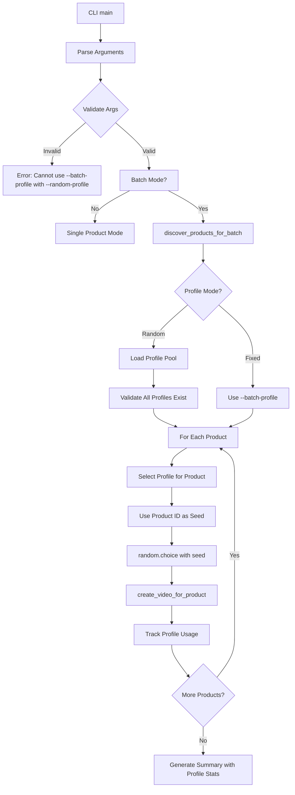

# Design Document

## Overview

The producer batch mode feature extends the existing video producer CLI to support profile randomization and enhanced batch processing. The current implementation already has batch mode (`--batch`, `--batch-profile`), but lacks profile randomization capability. This design adds:

1. **Profile Randomization** - Random profile selection per product with deterministic seeding
2. **Profile Pool Management** - Configurable list of profiles for randomization
3. **Enhanced Summary Reporting** - Profile usage distribution statistics

The implementation follows a minimalist approach by extending existing batch processing logic in `cli.py` rather than creating new modules.

## Steering Document Alignment

### Technical Standards (tech.md)

**Python Typing**: Modern type hints with `dict[str, Any]`, `list[str]`, `| None`

**Error Handling**: Specific exceptions for profile validation, graceful degradation for incompatible profiles

**Configuration Management**: 3-tier precedence (CLI > YAML > Defaults) consistent with existing patterns

**Logging**: Structured logging with profile selection context, using existing `setup_debug_logging` infrastructure

### Project Structure (structure.md)

**Module Organization**:
```
src/video/producer/
├── cli.py                     # Extended with profile randomization logic
├── orchestration.py           # Unchanged - handles single-product video creation
├── utils.py                   # Extended with profile selection utilities
└── ...                        # Other existing files unchanged
```

**Configuration Organization**:
```
config/
└── video_production.yaml      # Extended with profile_pool configuration
```

## Code Reuse Analysis

### Existing Components to Leverage

- **discover_products_for_batch()** (`cli.py:33`): Existing product discovery - reused without modification
- **Batch Processing Loop** (`cli.py:571-638`): Existing batch orchestration - extended with profile selection
- **VideoConfig** (`video/config.py`): Existing profile management - queried for available profiles
- **create_video_for_product()** (`orchestration.py`): Existing video pipeline - reused with different profiles
- **Argument Parser** (`cli.py:196`): Existing CLI setup - extended with `--random-profile` and `--profile-pool`

### Integration Points

- **CLI Entry Point** (`cli.py:main`): Extended with profile randomization arguments and logic
- **YAML Configuration** (`config/video_production.yaml`): New `profile_pool` list in batch settings
- **Batch Loop** (`cli.py:571-638`): Profile selection logic inserted before `create_video_for_product()` call
- **Summary Reporting** (`cli.py:640-665`): Extended to include profile usage distribution

## Architecture

### Modular Design Principles

- **Single File Responsibility**: Profile randomization logic contained in `cli.py` with batch processing
- **Component Isolation**: Profile selection is a pure function, testable in isolation
- **Service Layer Separation**: Profile validation separated from profile selection
- **Utility Modularity**: Profile randomization utilities added to `utils.py`



## Components and Interfaces

### Component 1: Profile Randomization Logic

- **Purpose:** Select random profile for each product with deterministic seeding
- **Location:** `src/video/producer/cli.py` (integrated into batch loop)
- **Interfaces:**
  ```python
  def select_profile_for_product(
      product_id: str,
      profile_pool: list[str],
      random_mode: bool,
      fixed_profile: str | None
  ) -> str:
      """Select profile for product (random or fixed)

      Args:
          product_id: Product identifier (ASIN or title) for seeding
          profile_pool: List of available profile names
          random_mode: Whether to use random selection
          fixed_profile: Fixed profile name (if not random)

      Returns:
          Selected profile name
      """
  ```
- **Dependencies:** `random` module, VideoConfig for profile validation
- **Reuses:** Existing VideoConfig.profile_exists() validation

### Component 2: Profile Pool Configuration

- **Purpose:** Load and validate profile pool from YAML and CLI
- **Location:** `src/video/producer/cli.py` (argument parsing), `config/video_production.yaml`
- **Interfaces:**
  ```python
  def load_profile_pool(
      cli_pool: list[str] | None,
      yaml_pool: list[str],
      video_config: VideoConfig
  ) -> list[str]:
      """Load profile pool with CLI > YAML > All profiles precedence

      Args:
          cli_pool: Profile pool from --profile-pool CLI arg
          yaml_pool: Profile pool from YAML configuration
          video_config: VideoConfig instance for querying available profiles

      Returns:
          List of profile names to use for randomization
      """
  ```
- **Dependencies:** argparse, YAML loader, VideoConfig
- **Reuses:** Existing YAML configuration loading patterns

### Component 3: Profile Usage Tracking

- **Purpose:** Track which profiles were used for statistics
- **Location:** `src/video/producer/cli.py` (batch loop)
- **Interfaces:**
  ```python
  class ProfileUsageTracker:
      """Track profile usage across batch for summary reporting"""

      def __init__(self):
          self.usage: dict[str, int] = {}

      def record(self, profile_name: str):
          """Record usage of a profile"""

      def get_distribution(self) -> dict[str, int]:
          """Get profile usage distribution"""

      def format_summary(self) -> str:
          """Format usage as readable string"""
  ```
- **Dependencies:** None (simple counter)
- **Reuses:** None (new utility class)

### Component 4: CLI Extension

- **Purpose:** Add profile randomization command-line arguments
- **Location:** `src/video/producer/cli.py` (argument parser)
- **Interfaces:**
  - New arguments: `--random-profile`, `--profile-pool`
  - Modified validation: Mutual exclusivity between `--batch-profile` and `--random-profile`
- **Dependencies:** argparse
- **Reuses:** Existing argument parser and validation patterns

## Data Models

### ProfilePool Configuration (YAML)

```yaml
batch:
  profile_pool: []  # Empty list means use all available profiles
```

### ProfileUsageStats

```python
from dataclasses import dataclass

@dataclass
class ProfileUsageStats:
    """Profile usage statistics for batch summary"""
    total_products: int                # Total products processed
    profile_distribution: dict[str, int]  # Profile name -> usage count
    randomization_enabled: bool        # Whether randomization was used
```

## Error Handling

### Error Scenarios

1. **Both --batch-profile and --random-profile Provided**
   - **Handling:** Raise `ValueError` with clear message at argument validation
   - **User Impact:** Immediate error before any processing starts: "Cannot use both --batch-profile and --random-profile"

2. **--random-profile Without --batch**
   - **Handling:** Raise `ValueError` at argument validation
   - **User Impact:** Immediate error: "--random-profile requires --batch mode"

3. **Invalid Profile in Pool**
   - **Handling:** Raise `ValueError` with list of invalid profiles
   - **User Impact:** Immediate error before processing: "Invalid profiles in pool: {invalid_names}. Available: {available_names}"

4. **Empty Profile Pool**
   - **Handling:** Use all available profiles from VideoConfig as fallback
   - **User Impact:** Log info message: "No profile pool specified, using all available profiles: {profile_list}"

5. **Profile Incompatible with Product Media**
   - **Handling:** Skip product, log as "SKIPPED", do not count as failure
   - **User Impact:** See in logs: "Skipped product {id}: Profile {name} requires media not available"

6. **Profile Selection Randomization Failure**
   - **Handling:** Should not occur (random.choice guaranteed to work with non-empty list)
   - **User Impact:** N/A (defensive programming only)

## Testing Strategy

### Unit Testing

**File:** `tests/video/producer/test_profile_randomization.py`

- **Test Profile Selection Logic**:
  - Deterministic selection (same product ID always gets same profile)
  - Random distribution across different product IDs
  - Fixed profile selection when randomization disabled
  - Seed-based reproducibility

- **Test Profile Pool Loading**:
  - CLI override of YAML configuration
  - YAML configuration fallback
  - Default to all profiles when pool empty
  - Invalid profile validation

- **Test Profile Usage Tracking**:
  - Correct counting of profile usage
  - Distribution calculation accuracy
  - Summary formatting

### Integration Testing

**File:** `tests/video/producer/test_batch_profile_integration.py`

- **Test End-to-End Batch with Random Profiles**:
  - Multiple products get different profiles
  - Same product ID always gets same profile (deterministic)
  - Profile usage distribution in summary
  - All profiles in pool get used over sufficient iterations

- **Test Configuration Precedence**:
  - CLI --profile-pool overrides YAML
  - YAML profile_pool used when no CLI override
  - All profiles used when pool not specified

- **Test Error Handling**:
  - Mutual exclusivity validation
  - Invalid profile detection
  - Graceful skipping of incompatible profiles

### End-to-End Testing

**Manual Test Scenarios:**

1. **Random Profile Selection**:
   ```bash
   poetry run python -m src.video.producer --batch --random-profile --profile-pool slideshow_images1 product_video_sequential --debug
   ```
   - Verify: Products get random profiles from pool, distribution shown in summary

2. **All Profiles Default Pool**:
   ```bash
   poetry run python -m src.video.producer --batch --random-profile --debug
   ```
   - Verify: All available profiles from VideoConfig used in rotation

3. **Deterministic Reproducibility**:
   - Run same batch twice with same product IDs
   - Verify: Each product gets same profile both times

4. **YAML Configuration**:
   - Add `profile_pool` list to `config/video_production.yaml`
   - Run without CLI arguments
   - Verify: YAML configuration used

## Implementation Notes

### CLI Argument Changes

**New:**
- `--random-profile`: `action="store_true"`, enables profile randomization
- `--profile-pool`: `nargs="+"`, space-separated profile names

**Validation:**
- Mutual exclusivity: `--batch-profile` XOR `--random-profile`
- Requires batch: `--random-profile` requires `--batch`

### YAML Schema Extension

**New section in `config/video_production.yaml`:**
```yaml
batch:
  profile_pool: []  # List of profile names for randomization
```

### Profile Selection Algorithm

```python
def select_profile_for_product(product_id: str, profile_pool: list[str]) -> str:
    """Deterministic random profile selection"""
    # Use product ID as seed for reproducibility
    seed = hash(product_id)
    random.seed(seed)
    return random.choice(profile_pool)
```

### Backward Compatibility

- Existing batch mode unchanged (`--batch` + `--batch-profile`)
- No breaking changes to existing CLI arguments
- YAML without `profile_pool` defaults to empty list
- All existing behavior preserved when new arguments not used
