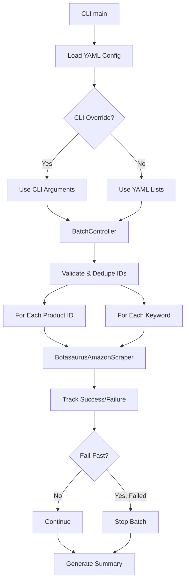

# Design Document

## Overview

The scraper batch mode feature extends the existing `BotasaurusAmazonScraper` to support batch processing of multiple products through configurable lists of product IDs and keywords. The design follows a minimalist approach by adding a thin orchestration layer around the existing single-product scraping logic, ensuring maximum code reuse and minimal coupling.

The implementation consists of:
1. **Batch Orchestrator** (`batch_controller.py`) - Manages product ID and keyword list processing
2. **Configuration Extension** - YAML schema additions for batch input lists
3. **CLI Extension** - New arguments `--product-ids` and `--fail-fast`
4. **Progress Tracking** - Batch-aware logging and summary reporting

## Steering Document Alignment

### Technical Standards (tech.md)

**Python Typing**: Modern type hints with `dict[str, Any]`, `list[str]`, `| None`

**Error Handling**: Specific exceptions for batch failures, graceful degradation for individual product errors

**Configuration Management**: 3-tier precedence (CLI > YAML > Defaults) consistent with existing patterns

**Logging**: Structured logging with batch context, using existing `setup_debug_logging` infrastructure

### Project Structure (structure.md)

**Module Organization**:
```
src/scraper/amazon/
├── scraper.py                 # Existing single-product scraper (unchanged)
├── batch_controller.py        # NEW: Batch orchestration logic
├── config.py                  # Extended for batch configuration
├── models.py                  # Extended with BatchConfig, BatchSummary
└── ...                        # Other existing files unchanged
```

**Separation of Concerns**: Batch logic isolated from core scraping logic

## Code Reuse Analysis

### Existing Components to Leverage

- **BotasaurusAmazonScraper** (`scraper.py`): Core scraping engine - reused without modification for each product
- **Configuration System** (`config.py`): Extended to load batch-specific YAML sections
- **Logging Infrastructure** (`logging_setup.py`): Reused for batch progress tracking
- **ASIN Validation** (`utils.py:validate_asin_format`): Reused for product ID validation
- **Search Parameters** (`models.py:SearchParameters`): Reused for keyword search filters
- **Output Management** (`config.py:get_output_path`): Reused for per-product directory creation

### Integration Points

- **CLI Entry Point** (`scraper.py:main`): Extended with new arguments (`--product-ids`, `--fail-fast`)
- **YAML Configuration** (`config/scraper.yaml`): New `batch` section for `product_ids` and `keywords` lists
- **Scraper Factory** (`base/__init__.py:get_scraper`): Returns existing scraper instance, batch logic wraps it

## Architecture

### Modular Design Principles

- **Single File Responsibility**: `batch_controller.py` handles only batch orchestration, not individual scraping
- **Component Isolation**: Batch controller is a thin wrapper that delegates to existing scraper
- **Service Layer Separation**: Batch configuration, orchestration, and reporting cleanly separated
- **Utility Modularity**: Validation, deduplication, and summary logic in focused functions



## Components and Interfaces

### Component 1: BatchController

- **Purpose:** Orchestrates batch processing of product IDs and keywords
- **Location:** `src/scraper/amazon/batch_controller.py`
- **Interfaces:**
  ```python
  class BatchController:
      def __init__(self, scraper: BotasaurusAmazonScraper, config: BatchConfig):
          """Initialize with scraper instance and batch configuration"""

      def run_batch(self) -> BatchSummary:
          """Execute batch scraping and return summary"""

      def _process_product_ids(self) -> list[ProductResult]:
          """Process explicit product ID list"""

      def _process_keywords(self) -> list[ProductResult]:
          """Process keyword search list"""

      def _deduplicate_products(self, products: list[ProductData]) -> list[ProductData]:
          """Remove duplicate products by ASIN"""
  ```
- **Dependencies:** `BotasaurusAmazonScraper`, `BatchConfig`, logging
- **Reuses:** Existing scraper's `scrape_products()` and `scrape_products_unified()` methods

### Component 2: Configuration Extension

- **Purpose:** Load and validate batch configuration from YAML and CLI
- **Location:** `src/scraper/amazon/config.py` (extended), `config/scraper.yaml` (schema extension)
- **Interfaces:**
  ```python
  def load_batch_config(cli_args: argparse.Namespace) -> BatchConfig:
      """Load batch config with CLI > YAML precedence"""

  def validate_batch_input(config: BatchConfig) -> None:
      """Validate at least one input source provided"""
  ```
- **Dependencies:** YAML loader, argparse
- **Reuses:** Existing `CONFIG` global dict and `get_default_search_parameters()`

### Component 3: Progress Tracker

- **Purpose:** Track and log batch progress with `[N/total]` format
- **Location:** `src/scraper/amazon/batch_controller.py` (embedded in BatchController)
- **Interfaces:**
  ```python
  class ProgressTracker:
      def log_start(self, total_ids: int, total_keywords: int):
          """Log batch start with counts"""

      def log_product_start(self, index: int, total: int, product_id: str):
          """Log [N/total] Scraping product: {id}"""

      def log_product_complete(self, product_id: str, success: bool):
          """Log success/failure status"""

      def generate_summary(self) -> BatchSummary:
          """Generate final summary report"""
  ```
- **Dependencies:** logging
- **Reuses:** Existing `setup_debug_logging()` infrastructure

### Component 4: CLI Extension

- **Purpose:** Add batch-specific command-line arguments
- **Location:** `src/scraper/amazon/scraper.py:main()` (extended)
- **Interfaces:**
  - New arguments: `--product-ids`, `--fail-fast`
  - Modified argument: `--keywords` (already exists, now supports multiple values)
- **Dependencies:** argparse
- **Reuses:** Existing argument parser and validation logic

## Data Models

### BatchConfig

```python
from dataclasses import dataclass
from typing import Optional

@dataclass
class BatchConfig:
    """Batch processing configuration"""
    product_ids: list[str]           # Product IDs to scrape
    keywords: list[str]               # Keywords to search
    fail_fast: bool                   # Stop on first failure
    search_params: SearchParameters   # Filters for keyword searches
    max_products: int                 # Max products across all sources
```

### BatchSummary

```python
@dataclass
class BatchSummary:
    """Batch execution summary"""
    total_attempted: int              # Total products attempted
    product_ids_attempted: int        # Product IDs attempted
    keywords_attempted: int           # Keywords attempted
    successful: int                   # Successfully scraped
    failed: int                       # Failed scrapes
    failed_products: list[str]        # ASINs of failed products
    media_stats: dict[str, int]       # Media collection statistics
    duration_sec: float               # Total batch duration
```

### ProductResult

```python
@dataclass
class ProductResult:
    """Individual product scraping result"""
    product_id: str                   # ASIN or keyword
    success: bool                     # Scraping succeeded
    data: Optional[ProductData]       # Product data if successful
    error: Optional[str]              # Error message if failed
    source: str                       # "product_id" or "keyword"
```

## Error Handling

### Error Scenarios

1. **Invalid Product ID Format**
   - **Handling:** Log warning, skip invalid ID, continue with valid IDs
   - **User Impact:** See warning in logs, batch continues with remaining IDs

2. **Empty Input (No Product IDs or Keywords)**
   - **Handling:** Raise `ValueError` with clear message at startup
   - **User Impact:** Immediate error before any scraping starts

3. **Individual Product Scraping Failure**
   - **Handling:**
     - If `--fail-fast`: Stop entire batch, generate summary
     - Otherwise: Log error, mark as failed, continue to next product
   - **User Impact:** See error in logs, summary shows failed products

4. **Keyword Search Failure**
   - **Handling:** Log error, continue to next keyword in list
   - **User Impact:** See error in logs, summary shows failed searches

5. **Duplicate Product IDs Across Sources**
   - **Handling:** Deduplicate by ASIN before final summary
   - **User Impact:** Transparent deduplication, see final unique count in summary

6. **Max Products Limit Reached**
   - **Handling:** Stop processing remaining keywords when limit reached
   - **User Impact:** See message "Max products reached, stopping keyword processing"

## Testing Strategy

### Unit Testing

**File:** `tests/scraper/test_batch_controller.py`

- **Test Batch Configuration Loading**:
  - CLI override of YAML configuration
  - YAML configuration fallback
  - Empty input validation
  - Product ID format validation

- **Test Deduplication Logic**:
  - Duplicate product IDs in single list
  - Duplicate products across product_ids and keywords
  - Preserve order after deduplication

- **Test Progress Tracking**:
  - Correct `[N/total]` format
  - Success/failure counting
  - Summary report generation

### Integration Testing

**File:** `tests/scraper/test_batch_integration.py`

- **Test End-to-End Batch Scraping**:
  - Product ID list processing
  - Keyword list processing
  - Mixed input (product IDs + keywords)
  - Fail-fast behavior
  - Summary report accuracy

- **Test Configuration Precedence**:
  - CLI arguments override YAML
  - YAML configuration used when no CLI override
  - Search parameters applied to all keyword searches

### End-to-End Testing

**Manual Test Scenarios:**

1. **Basic Product ID List**:
   ```bash
   poetry run python -m src.scraper.amazon.scraper --product-ids B0ASIN1 B0ASIN2 B0ASIN3 --debug
   ```
   - Verify: 3 products scraped, separate output directories, summary report

2. **Keyword List with Filters**:
   ```bash
   poetry run python -m src.scraper.amazon.scraper --keywords "wireless earbuds" "bluetooth headphones" --min-rating 4.0 --max-products 5 --debug
   ```
   - Verify: Max 5 products across both keywords, filters applied, deduplication

3. **Mixed Input with Fail-Fast**:
   ```bash
   poetry run python -m src.scraper.amazon.scraper --product-ids INVALID --keywords "test" --fail-fast --debug
   ```
   - Verify: Stops on first failure (invalid ID), summary shows failure

4. **YAML Configuration**:
   - Add `product_ids` list to `config/scraper.yaml`
   - Run without CLI arguments
   - Verify: YAML configuration used, products scraped

## Implementation Notes

### CLI Argument Changes

**Modified:**
- `--keywords`: Change from single value to `nargs="+"` for multiple keywords

**New:**
- `--product-ids`: `nargs="+"`, space-separated ASINs
- `--fail-fast`: `action="store_true"`, stop on first failure

### YAML Schema Extension

**New section in `config/scraper.yaml`:**
```yaml
scraper:
  platform: amazon
  batch:
    product_ids: []
    keywords: []
  # ... existing configuration
```

### Backward Compatibility

- Existing single-product mode unchanged (no breaking changes)
- `--keywords` with single value still works
- YAML without `batch` section defaults to empty lists
- All existing CLI arguments and behavior preserved
