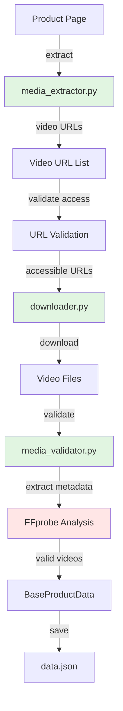

# Design Document

## Overview

The scraper-video-detection feature enhances ContentEngineAI's existing video extraction infrastructure to ensure reliable, high-quality product video acquisition from Amazon. The current implementation (`media_extractor.py`) already includes comprehensive video extraction logic using a 3-method approach (JavaScript extraction, thumbnail clicking, direct element extraction). This design focuses on validating, hardening, and extending the existing system to guarantee consistent video delivery to the video assembly pipeline.

The implementation will leverage existing scraper patterns while adding metadata extraction, enhanced validation, and improved error handling to meet the requirements for video-first content creation.

## Steering Document Alignment

### Technical Standards (tech.md)

This design follows ContentEngineAI's established technical patterns:
- **Async/Await Patterns**: Uses existing Botasaurus task-based async patterns for downloads
- **Error Handling**: Implements graceful degradation with structured logging
- **Configuration Management**: Extends existing YAML configuration in `config/scraper.yaml`
- **Type Annotations**: Uses modern Python typing with Pydantic models
- **Naming Conventions**: snake_case functions, PascalCase classes, following project standards

### Project Structure (structure.md)

Implementation follows existing scraper module organization:
```
src/scraper/
├── base/
│   └── models.py (extends BaseProductData)
├── amazon/
│   ├── media_extractor.py (video extraction - VALIDATE)
│   ├── downloader.py (download logic - ENHANCE)
│   ├── media_validator.py (validation - EXTEND)
│   └── scraper.py (orchestration - UPDATE)
└── config/scraper.yaml (configuration - UPDATE)
```

## Code Reuse Analysis

### Existing Components to Leverage

- **`media_extractor.py::extract_functional_videos_with_validation()`** (lines 362-1166): Comprehensive 3-method video extraction already implemented. Will validate and enhance with metadata extraction.
- **`downloader.py::download_file_sync()`** (lines 457-565): Synchronous download with streaming chunks. Will reuse for video downloads with timeout adjustments.
- **`media_validator.py::verify_video_file()`** (lines 173-393): FFprobe-based validation with codec/duration/resolution checks. Will extend with additional quality metrics.
- **`models.py::BaseProductData`** (lines 35-103): Already includes `videos: list[str]` and `downloaded_videos: list[str]` fields. No changes needed.
- **`scraper.yaml::video_config`** (lines 108-128): Existing configuration structure. Will extend with new parameters.

### Integration Points

- **Video Producer Integration**: Producer reads `downloaded_videos` from `data.json` (produced by scraper)
- **FFmpeg Integration**: Use existing FFprobe calls in `media_validator.py` for metadata extraction
- **Configuration System**: Extend existing `video_config` section in `scraper.yaml`
- **Validation Reports**: Leverage `generate_validation_report()` in `media_validator.py` for video validation summaries

## Architecture

The design follows a **3-stage pipeline architecture** aligned with existing scraper patterns:



### Modular Design Principles

- **Single File Responsibility**: Each file handles one concern (extraction, download, validation)
- **Component Isolation**: Video logic isolated in dedicated methods within existing modules
- **Service Layer Separation**: Clear separation between extraction (media_extractor), download (downloader), and validation (media_validator)
- **Utility Modularity**: Metadata extraction as separate utility function for reusability

## Components and Interfaces

### Component 1: Video URL Extractor (media_extractor.py)

- **Purpose**: Extract high-quality video URLs from Amazon product pages using multi-method approach
- **Status**: Already implemented (lines 362-1166). Requires validation and testing.
- **Interfaces**:
  ```python
  async def extract_functional_videos_with_validation(
      driver: AntiDetectDriver,
      page_url: str,
      asin: str,
      max_videos: int = 5
  ) -> list[str]
  ```
- **Dependencies**:
  - Botasaurus AntiDetectDriver for page interaction
  - `is_valid_video_url()` for URL filtering (lines 1261-1286)
  - `validate_video_url_accessibility()` for HEAD request validation (lines 1289-1416)
- **Reuses**:
  - Existing 3-method extraction pattern (JavaScript → Clicking → Fallback)
  - Product matching logic using ASIN/brand/model keywords

### Component 2: Video Metadata Extractor (NEW in media_validator.py)

- **Purpose**: Extract video metadata (duration, resolution, codec) using FFprobe
- **Interfaces**:
  ```python
  def extract_video_metadata(video_path: Path) -> dict[str, Any]:
      """
      Extract comprehensive video metadata using FFprobe.

      Returns:
          {
              "duration": float,  # seconds
              "width": int,
              "height": int,
              "codec": str,
              "format": str,
              "bitrate": int,
              "has_audio": bool
          }
      """
  ```
- **Dependencies**: FFprobe (via subprocess or ffmpeg-python)
- **Reuses**: Existing FFprobe patterns in `verify_video_file()` (lines 173-393)

### Component 3: Video Downloader (downloader.py)

- **Purpose**: Download validated video URLs with streaming and timeout handling
- **Status**: Existing `download_file_sync()` works for videos. May need timeout adjustment.
- **Interfaces**:
  ```python
  def download_file_sync(
      url: str,
      destination: Path,
      timeout: int = 300,  # Increased for videos
      chunk_size: int = 8192
  ) -> bool
  ```
- **Dependencies**: requests library with streaming
- **Reuses**: Existing synchronous download with chunk streaming (lines 457-565)
- **Enhancement**: Increase default timeout for video downloads (30s → 300s)

### Component 4: Video Validator (media_validator.py)

- **Purpose**: Validate downloaded videos for quality, format, and integrity
- **Status**: Existing `verify_video_file()` provides comprehensive validation. Extend with metadata integration.
- **Interfaces**:
  ```python
  def verify_video_file(
      video_path: Path,
      min_dimension: int = 640,
      min_duration: float = 1.0
  ) -> tuple[bool, str, dict[str, Any]]  # (is_valid, reason, metadata)
  ```
- **Dependencies**: FFprobe for validation
- **Reuses**: Existing video validation logic (lines 173-393)
- **Enhancement**: Return metadata dict alongside validation result

### Component 5: Scraper Orchestrator (scraper.py)

- **Purpose**: Coordinate video extraction, download, validation, and metadata storage
- **Status**: Existing orchestration handles images. Extend to handle videos similarly.
- **Interfaces**: Updates to existing scraper workflow methods
- **Dependencies**: All above components
- **Reuses**: Existing image processing workflow pattern

## Data Models

### BaseProductData (Existing - No Changes)

```python
@dataclass
class BaseProductData:
    # Video fields (already exist)
    videos: list[str] = field(default_factory=list)  # Extracted URLs
    downloaded_videos: list[str] = field(default_factory=list)  # File paths

    # Image fields (existing)
    images: list[str] = field(default_factory=list)
    downloaded_images: list[str] = field(default_factory=list)

    # Product metadata (existing)
    title: str
    price: float | None
    url: str
    platform: str
    platform_id: str  # ASIN for Amazon
```

### VideoMetadata (NEW - Internal Use)

```python
@dataclass
class VideoMetadata:
    """Video metadata extracted via FFprobe."""
    duration: float  # seconds
    width: int
    height: int
    codec: str
    format: str
    bitrate: int | None
    has_audio: bool
    file_size: int  # bytes
    file_path: str  # relative path from outputs root
```

**Storage**: Metadata saved in validation report JSON, not in BaseProductData (to avoid bloat).

## Error Handling

### Error Scenarios

1. **No Videos Found on Product Page**
   - **Handling**: Log info message, continue with images only. Set `videos` field to empty list.
   - **User Impact**: Product processed successfully with image-only content.

2. **Video URL Validation Fails (HEAD Request)**
   - **Handling**: Skip inaccessible video, try remaining videos. Log warning with URL.
   - **User Impact**: Only accessible videos downloaded. No pipeline failure.

3. **Video Download Timeout (>300s)**
   - **Handling**: Abort download, log error, retry once with exponential backoff. Skip if second attempt fails.
   - **User Impact**: Large videos may be skipped. User sees clear timeout message in logs.

4. **Downloaded Video File Corrupted**
   - **Handling**: FFprobe validation detects corruption. Delete file, log error, skip video.
   - **User Impact**: Invalid video not used. Validation report shows reason.

5. **FFprobe Metadata Extraction Fails**
   - **Handling**: Log warning, continue without metadata. Video still usable if file valid.
   - **User Impact**: Video processed without duration/resolution metadata. Producer uses default handling.

6. **All Videos Fail to Download**
   - **Handling**: Continue product processing with images only. Set `downloaded_videos` to empty list.
   - **User Impact**: Product processed as image-only slideshow. No pipeline failure.

7. **Network Errors During Download**
   - **Handling**: Retry with exponential backoff (max 2 retries). Skip video if all retries fail.
   - **User Impact**: Transient errors handled automatically. Persistent errors logged clearly.

## Testing Strategy

### Unit Testing

**Target Files**:
- `media_validator.py::extract_video_metadata()` (NEW function)
- `media_validator.py::verify_video_file()` (existing - validate enhancement)
- `media_extractor.py::is_valid_video_url()` (existing - validate behavior)

**Test Cases**:
- Valid video file metadata extraction
- Corrupted video file detection
- Missing FFprobe handling
- URL validation with various formats
- Duration/resolution threshold validation

**Mocking Strategy**:
- Mock FFprobe subprocess calls with sample JSON output
- Mock file system operations with temporary test files
- Use sample MP4 files for validation tests

### Integration Testing

**Target Workflow**:
- End-to-end: Product page → Video URLs → Download → Validation → Metadata → data.json

**Test Cases**:
1. Product with multiple videos: Verify all downloaded and validated
2. Product with no videos: Verify graceful handling (images only)
3. Product with mixed quality videos: Verify filtering by min_dimension/min_duration
4. Network failure scenario: Verify retry logic and graceful degradation
5. Invalid video URL scenario: Verify HEAD request filtering

**Test Products**:
- Use real Amazon ASINs with known video content
- Test with `--debug` flag for detailed logging

### End-to-End Testing

**User Scenarios**:

1. **Video-First Product Processing**:
   - Input: ASIN with 3+ product videos
   - Expected: All videos downloaded, validated, metadata extracted, paths in data.json
   - Verification: Check `outputs/{ASIN}/videos/` directory and `downloaded_videos` field

2. **Mixed Media Product Processing**:
   - Input: ASIN with 2 videos + 5 images
   - Expected: Both media types downloaded, validation report shows all valid
   - Verification: Producer can use videos in assembly pipeline

3. **Image-Only Fallback**:
   - Input: ASIN with no videos
   - Expected: Image-only processing succeeds, `downloaded_videos` empty list
   - Verification: No errors, product data complete

**Performance Testing**:
- Video download time for 5 videos (~50MB total): <120 seconds
- Metadata extraction per video: <2 seconds
- Validation per video: <3 seconds

**Test Command**:
```bash
poetry run python -m src.scraper.amazon.scraper \
  --keywords B0BTYCRJSS \  # Known ASIN with videos
  --debug \
  --clean
```
