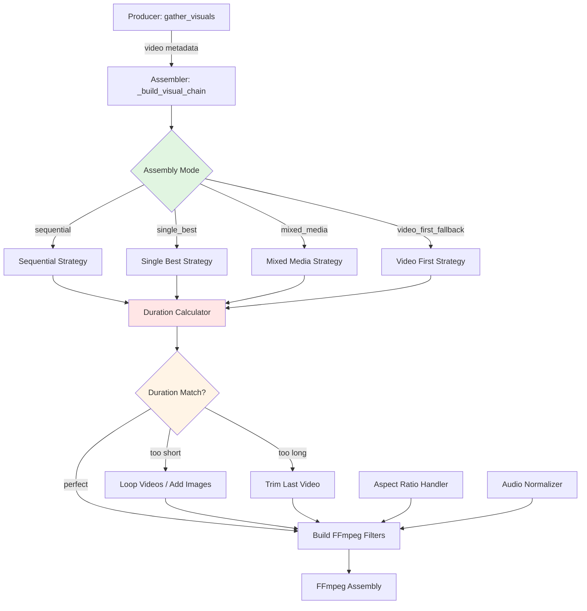

# Design Document

## Overview

The video-product-assembly feature extends ContentEngineAI's video producer to support flexible product video assembly with four configurable modes (sequential, single-best, mixed-media, video-first-fallback), dynamic aspect ratio handling (letterbox, crop-to-fit, smart-scale), and audio normalization. The current system (assembler.py) already processes videos alongside images using FFmpeg filter chains, but treats all media uniformly. This design adds intelligent video-specific processing with mode-based assembly algorithms, format normalization, and enhanced configuration support.

The implementation leverages the existing modular architecture: producer orchestration (producer.py), FFmpeg filter construction (assembler.py), and profile-based configuration (video_config.py).

## Steering Document Alignment

### Technical Standards (tech.md)

This design follows ContentEngineAI's established patterns:
- **Async/Await Patterns**: Uses existing async producer pipeline with `asyncio.gather()` for parallel operations
- **Error Handling**: Implements graceful degradation with structured logging and fallback strategies
- **Configuration Management**: Extends Pydantic models in `video_config.py` with new video assembly parameters
- **Type Annotations**: Modern Python typing throughout (`dict[str, Any]`, `| None`)
- **Naming Conventions**: snake_case functions, PascalCase classes

### Project Structure (structure.md)

Implementation follows existing video producer organization:
```
src/video/
├── producer.py (orchestration - EXTEND)
├── assembler.py (FFmpeg filters - ENHANCE)
├── video_config.py (configuration - EXTEND)
└── subtitle_positioning.py (subtitles - NO CHANGES)

config/
└── video_production.yaml (profiles - ADD NEW)
```

## Code Reuse Analysis

### Existing Components to Leverage

- **`assembler.py::_build_visual_chain()`** (lines 864-1068): Core visual assembly logic. Will extend with assembly mode logic and video-specific processing.
- **`assembler.py::_get_media_duration()`** (lines 292-310): Async duration extraction via FFprobe. Will reuse for video duration calculations.
- **`assembler.py::_is_video()`** (lines 210-224): Video detection via MIME type. Already implemented, no changes needed.
- **`producer.py::gather_visuals()`** (lines 733-817): Media collection. Will extend to track video metadata.
- **`video_config.py::VideoProfile`** (lines 315-475): Profile model. Will extend with new video assembly fields.
- **`video_config.py::get_profile_merged_settings()`** (lines 1133-1517): Profile merging with CLI overrides. Will handle new video settings.

### Integration Points

- **FFmpeg Filter Chain Construction**: Extend `_build_visual_chain()` with mode-specific logic
- **Configuration System**: Add new Pydantic fields to `VideoSettings` and `VideoProfile` models
- **Profile System**: Add 4 new video profiles to `video_production.yaml` (product_video_sequential, etc.)
- **Duration Matching**: Use existing `_get_media_duration()` for video duration calculations
- **Audio Mixing**: Extend `_build_audio_filters()` to handle video audio tracks

## Architecture

The design implements a **mode-based video assembly system** with strategy pattern for assembly modes:



### Modular Design Principles

- **Single File Responsibility**: Mode logic in separate methods within `assembler.py`, configuration in `video_config.py`
- **Component Isolation**: Video assembly strategies independent and testable
- **Service Layer Separation**: Producer orchestrates, assembler implements, config validates
- **Utility Modularity**: Duration calculation, aspect ratio logic as reusable functions

## Components and Interfaces

### Component 1: Video Assembly Mode Selector (NEW in assembler.py)

- **Purpose**: Select and execute appropriate video assembly strategy based on profile configuration
- **Interfaces**:
  ```python
  def _assemble_videos_by_mode(
      self,
      mode: Literal["sequential", "single_best", "mixed_media", "video_first_fallback"],
      video_files: list[Path],
      image_files: list[Path],
      target_duration: float,
      transition_duration: float
  ) -> tuple[list[tuple[Path, float]], str]:  # (timed_visuals, mode_info)
  ```
- **Dependencies**: `_get_media_duration()`, mode-specific strategy methods
- **Reuses**: Existing visual timing calculation patterns from `_build_visual_chain()`

### Component 2: Sequential Mode Strategy (NEW in assembler.py)

- **Purpose**: Concatenate all videos end-to-end with transitions
- **Interfaces**:
  ```python
  def _assemble_sequential(
      self,
      video_files: list[Path],
      image_files: list[Path],
      target_duration: float,
      transition_duration: float
  ) -> list[tuple[Path, float]]:  # timed_visuals
  ```
- **Logic**:
  1. Get duration of each video file
  2. Calculate total video duration
  3. If insufficient: loop last video or add images
  4. If excessive: trim last video with fade-out
  5. Apply crossfade transitions between clips
- **Dependencies**: `_get_media_duration()`, `_calculate_loop_count()`
- **Reuses**: Transition duration from existing config

### Component 3: Single Best Mode Strategy (NEW in assembler.py)

- **Purpose**: Select longest video and loop seamlessly
- **Interfaces**:
  ```python
  def _assemble_single_best(
      self,
      video_files: list[Path],
      target_duration: float,
      transition_duration: float
  ) -> list[tuple[Path, float]]:  # timed_visuals (repeated video entries)
  ```
- **Logic**:
  1. Find longest video by duration
  2. Calculate loop count: `ceil(target_duration / video_duration)`
  3. Create timed_visuals list with repeated video entries
  4. Apply crossfade at each loop point
- **Dependencies**: `_get_media_duration()`, `math.ceil`
- **Reuses**: Crossfade filter from existing transition system

### Component 4: Mixed Media Mode Strategy (NEW in assembler.py)

- **Purpose**: Interleave videos and images throughout timeline
- **Interfaces**:
  ```python
  def _assemble_mixed_media(
      self,
      video_files: list[Path],
      image_files: list[Path],
      target_duration: float,
      transition_duration: float,
      image_display_duration: float
  ) -> list[tuple[Path, float]]:  # timed_visuals (alternating media)
  ```
- **Logic**:
  1. Calculate video placement intervals: `target_duration / (len(videos) + 1)`
  2. Place videos at calculated intervals
  3. Fill gaps with images (equal duration each)
  4. Apply transitions between all media types
- **Dependencies**: `_get_media_duration()`, timeline distribution algorithm
- **Reuses**: Image duration calculation from existing slideshow logic

### Component 5: Video-First Fallback Mode Strategy (NEW in assembler.py)

- **Purpose**: Use all videos first, add images for remaining time
- **Interfaces**:
  ```python
  def _assemble_video_first_fallback(
      self,
      video_files: list[Path],
      image_files: list[Path],
      target_duration: float,
      transition_duration: float,
      image_display_duration: float
  ) -> list[tuple[Path, float]]:  # timed_visuals
  ```
- **Logic**:
  1. Get all video durations and sum
  2. Place all videos sequentially at start
  3. Calculate remaining duration
  4. Add images for remaining time
  5. Apply transitions at video boundaries and video-to-image transition
- **Dependencies**: `_get_media_duration()`
- **Reuses**: Existing image timing logic

### Component 6: Aspect Ratio Handler (NEW in assembler.py)

- **Purpose**: Apply configurable aspect ratio transformations (letterbox, crop, smart-scale)
- **Interfaces**:
  ```python
  def _apply_aspect_ratio_mode(
      self,
      input_label: str,
      aspect_mode: Literal["letterbox", "crop_to_fit", "smart_scale"],
      target_width: int,
      target_height: int,
      video_width: int,
      video_height: int
  ) -> tuple[str, str]:  # (filter_string, output_label)
  ```
- **Logic**:
  - **Letterbox**: `scale=w:h:force_original_aspect_ratio=decrease,pad=w:h:(w-iw)/2:(h-ih)/2:black`
  - **Crop-to-fit**: `scale=w:h:force_original_aspect_ratio=increase,crop=w:h`
  - **Smart-scale**: Calculate aspect ratio difference, choose mode automatically
- **Dependencies**: Video dimensions from `_get_media_dimensions()`
- **Reuses**: Existing scale/pad filter patterns from `_build_visual_chain()`

### Component 7: Audio Normalizer (ENHANCE in assembler.py)

- **Purpose**: Handle video audio tracks (removal or mixing at configurable volume)
- **Interfaces**:
  ```python
  def _build_audio_filters_with_video_audio(
      self,
      voiceover_idx: int,
      music_idx: int,
      video_audio_indices: list[int],
      video_audio_handling: Literal["remove", "mixed"],
      video_original_volume: int
  ) -> tuple[list[str], str]:  # (audio_filters, final_audio_label)
  ```
- **Logic**:
  - **Remove mode**: Use `-an` flag on video inputs (no audio mapping)
  - **Mixed mode**: Add video audio to amix with volume adjustment filter
- **Dependencies**: Existing `_build_audio_filters()` (lines 595-648)
- **Reuses**: Volume filter and amix patterns from current audio mixing

### Component 8: Format Normalizer (NEW utility in assembler.py)

- **Purpose**: Detect and transcode videos to H.264/30fps/yuv420p if needed
- **Interfaces**:
  ```python
  async def _normalize_video_format(
      self,
      video_path: Path,
      cache_dir: Path
  ) -> Path:  # Returns original or normalized path
  ```
- **Logic**:
  1. Probe video with FFprobe (codec, fps, pixel_format)
  2. If already correct format: return original path
  3. If needs transcoding: generate cache path, transcode, return cache path
  4. Use FFmpeg: `-c:v libx264 -preset medium -r 30 -pix_fmt yuv420p`
- **Dependencies**: `_get_media_dimensions()`, subprocess for FFmpeg
- **Reuses**: FFmpeg command construction patterns

### Component 9: Configuration Models (EXTEND in video_config.py)

- **Purpose**: Add Pydantic models for new video assembly settings
- **New Fields in VideoSettings**:
  ```python
  video_assembly_mode: Literal["sequential", "single_best", "mixed_media", "video_first_fallback"] = "sequential"
  video_aspect_mode: Literal["letterbox", "crop_to_fit", "smart_scale"] = "letterbox"
  video_audio_handling: Literal["remove", "mixed"] = "remove"
  video_original_volume: int = -30  # dB, range -60 to 0
  video_transition_duration: float = 0.5  # seconds
  enable_format_normalization: bool = True
  video_cache_dir: str = "outputs/.video_cache"
  ```
- **Dependencies**: Pydantic validation
- **Reuses**: Existing `VideoSettings` model structure (lines 106-144)

### Component 10: Video Profile Examples (NEW in video_production.yaml)

- **Purpose**: Provide 4 pre-configured profiles for different video assembly strategies
- **Profiles**:
  ```yaml
  product_video_sequential:
    use_scraped_videos: true
    video_assembly_mode: "sequential"
    video_aspect_mode: "letterbox"
    video_audio_handling: "remove"

  product_video_single:
    use_scraped_videos: true
    video_assembly_mode: "single_best"
    video_aspect_mode: "crop_to_fit"
    video_audio_handling: "mixed"
    video_original_volume: -30

  product_video_mixed:
    use_scraped_videos: true
    use_scraped_images: true
    video_assembly_mode: "mixed_media"
    video_aspect_mode: "smart_scale"

  product_video_primary:
    use_scraped_videos: true
    use_scraped_images: true
    video_assembly_mode: "video_first_fallback"
    video_aspect_mode: "letterbox"
  ```
- **Dependencies**: Profile merging system in `video_config.py`
- **Reuses**: Existing profile structure from slideshow_images* profiles

## Data Models

### TimedVisual (Existing - No Changes)

```python
tuple[Path, float]  # (media_path, duration_seconds)
```
- Used in `_build_visual_chain()` return value
- Represents each visual segment in timeline

### VideoAssemblyStrategy (NEW - Internal Type)

```python
Literal["sequential", "single_best", "mixed_media", "video_first_fallback"]
```
- Configuration enum for assembly mode selection

### AspectRatioMode (NEW - Internal Type)

```python
Literal["letterbox", "crop_to_fit", "smart_scale"]
```
- Configuration enum for aspect ratio handling

### AudioHandlingMode (NEW - Internal Type)

```python
Literal["remove", "mixed"]
```
- Configuration enum for video audio processing

## Error Handling

### Error Scenarios

1. **No Videos Available in Product Data**
   - **Handling**: Fall back to image-only slideshow mode. Log info message.
   - **User Impact**: Product processed successfully with images only. No pipeline failure.

2. **Video File Corrupted or Unreadable**
   - **Handling**: Skip corrupted video, continue with remaining videos. Log error with file path.
   - **User Impact**: Partial video content used. Video still assembled if ≥1 valid video exists.

3. **FFmpeg Duration Extraction Fails**
   - **Handling**: Log warning, assume default duration (5s). Continue processing.
   - **User Impact**: Duration matching may be less precise. Video still assembles.

4. **Format Normalization Fails (Transcoding Error)**
   - **Handling**: Log error, use original video file. May cause assembly issues if incompatible.
   - **User Impact**: Final video may have format inconsistencies. Clear error message logged.

5. **Video Dimensions Cannot Be Determined**
   - **Handling**: Return (0, 0), use default scaling. Log warning.
   - **User Impact**: Aspect ratio handling falls back to default behavior.

6. **Duration Matching Impossible (Videos Too Long)**
   - **Handling**: Trim last video aggressively with fade-out. Log warning about content loss.
   - **User Impact**: End of last video may be cut off. Duration matches voiceover.

7. **Mixed Audio Causes Clipping**
   - **Handling**: FFmpeg amix filter handles overflow. May reduce overall volume.
   - **User Impact**: Audio may be quieter than expected. No distortion.

## Testing Strategy

### Unit Testing

**Target Components**:
- `_assemble_videos_by_mode()` - Mode selection logic
- `_assemble_sequential()`, `_assemble_single_best()`, etc. - Individual strategies
- `_apply_aspect_ratio_mode()` - Aspect ratio filter generation
- `_normalize_video_format()` - Format detection and transcoding

**Test Cases**:
- Each assembly mode with various video/image counts
- Aspect ratio mode selection and filter string generation
- Audio handling mode filter construction
- Duration matching edge cases (exact match, too short, too long)
- Format normalization with different codecs/fps/formats

**Mocking Strategy**:
- Mock `_get_media_duration()` to return controlled durations
- Mock `_get_media_dimensions()` for aspect ratio tests
- Mock FFmpeg subprocess calls for format normalization
- Use temporary test video files (sample MP4s)

### Integration Testing

**Target Workflow**:
- End-to-end: Product data → Video assembly → Final MP4 output

**Test Cases**:
1. **Sequential mode**: 3 videos + 5 images → concatenated video with transitions
2. **Single best mode**: 1 long video → looped seamlessly to 30s
3. **Mixed media mode**: 2 videos + 4 images → interleaved timeline
4. **Video-first fallback**: 2 short videos + images → videos first, then images
5. **Aspect ratio modes**: Test letterbox/crop/smart-scale with 16:9 and 4:3 videos
6. **Audio handling**: Test remove vs mixed modes with videos containing audio

**Test Products**:
- Use scraped product data with downloaded videos
- Create synthetic test cases with known video files

### End-to-End Testing

**User Scenarios**:

1. **Video-Rich Product (5 videos, 3 images)**:
   - Profile: product_video_sequential
   - Expected: All videos concatenated with images filling gaps
   - Verification: Final video duration matches voiceover ±1s, all videos present

2. **Single Hero Video Product (1 long video)**:
   - Profile: product_video_single
   - Expected: Video looped seamlessly with crossfades
   - Verification: No visible loop discontinuities, duration perfect

3. **Mixed Content Product (2 videos, 10 images)**:
   - Profile: product_video_mixed
   - Expected: Videos evenly distributed, images fill timeline
   - Verification: Smooth transitions, visual variety maintained

4. **Video-First Product (3 short videos, 8 images)**:
   - Profile: product_video_primary
   - Expected: Videos play first, images follow
   - Verification: Clear video → image transition, duration match

**Performance Testing**:
- Video assembly time (excluding voiceover): <60s for 30s output
- Format normalization: <30s per video
- Memory usage: Streaming, no excessive buffering

**Test Command**:
```bash
poetry run python -m src.video.producer \
  outputs/{ASIN}/data.json \
  product_video_sequential \
  --debug
```
