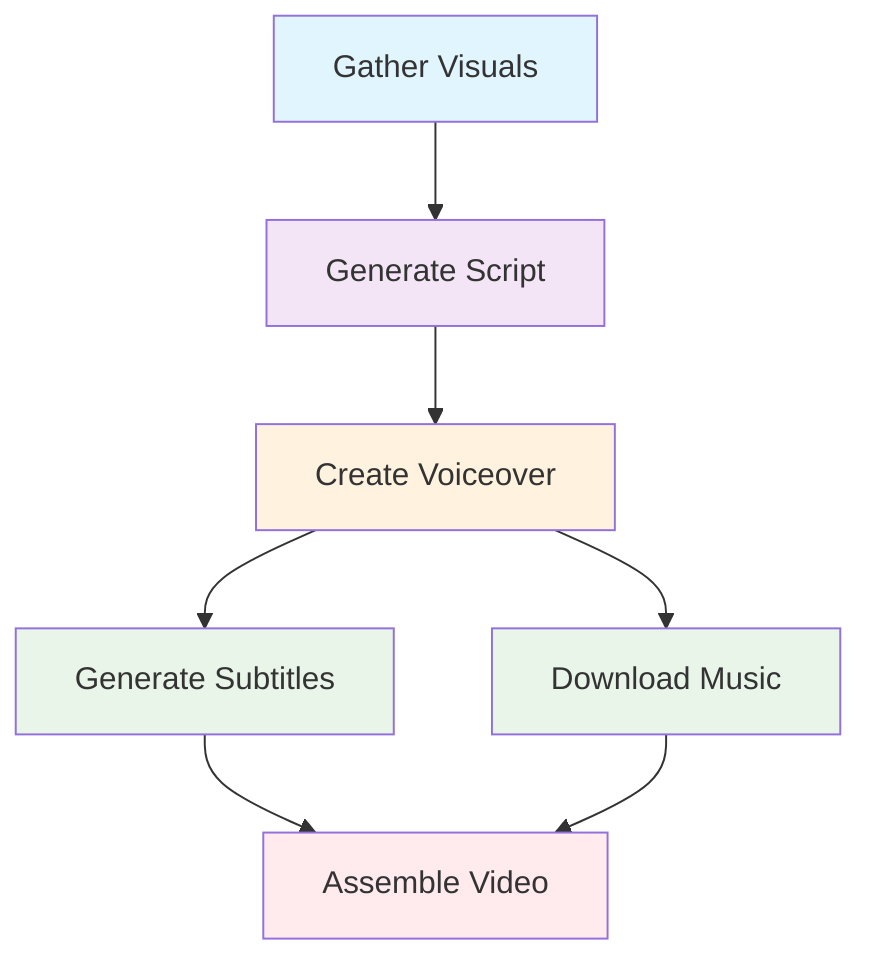

# ContentEngineAI

[](https://opensource.org/licenses/MIT)
[](https://www.python.org/downloads/release/python-312/)
[](https://github.com/astral-sh/ruff)
[](VERSIONING.md)

**Version**: 0.1.0
**License**: MIT
**Authors**: ContentEngineAI Team <stkzlv+ContentEngineAI@gmail.com>

> **⚠️ Pre-Production Software**: ContentEngineAI is under active development. While functional, breaking changes may occur in minor versions until 1.0.0. See [VERSIONING.md](VERSIONING.md) for our stability roadmap.

> **🚀 Initial Release**: ContentEngineAI v0.1.0 - Complete AI video production pipeline now available as open source! See [STATUS.md](STATUS.md) for current capabilities.

ContentEngineAI is an AI-powered pipeline for generating short, vertical (9:16) promotional videos for e-commerce products, primarily Amazon listings. It automates the entire process from scraping product data to assembling a final video, including AI script generation, stock media fetching, voiceover production, and subtitle generation.


## ✨ Key Features

- **🤖 End-to-End Automation**: Complete video production pipeline from data to final video
- **🌐 Multi-Platform Scraping**: Modular architecture supporting Amazon with extensible foundation for eBay, Walmart, and other platforms
- **⚡ Parallel Processing**: Optimized pipeline with concurrent step execution
- **🎯 Multi-Provider Support**: Fallback mechanisms for AI services (OpenRouter, Google Cloud, local models)
- **📱 Vertical Video Optimized**: 9:16 aspect ratio perfect for social media platforms
- **🎨 Professional Quality**: Dynamic visuals, audio-synchronized subtitles, background music
- **🎤 High-Quality Voice**: Chirp 3 HD voices with perfect subtitle timing via Whisper STT
- **⚙️ Highly Configurable**: YAML-based configuration with 100+ customizable parameters
- **📊 Performance Monitoring**: Built-in metrics collection and analysis tools
- **🔄 Resume Capability**: Debug and re-run individual pipeline steps
- **🏗️ Enterprise Architecture**: 11-module scraper design with factory pattern, clean APIs, and comprehensive code quality
- **🧹 Professional Code Standards**: 88-character line limit, comprehensive type safety, and consistent formatting

## 🚀 Quick Start

### Prerequisites

- Python 3.12+
- FFmpeg
- Poetry

### Installation

```bash
# Clone repository
git clone https://github.com/ContentEngineAI/ContentEngineAI.git
cd ContentEngineAI

# Install dependencies
poetry install
poetry run playwright install

# Setup API keys (see Installation Guide for details)
cp .env.example .env
# Edit .env with your API keys
```

**📖 Detailed setup instructions**: [INSTALL.md](INSTALL.md)

### Basic Usage

```bash
# Generate video for Amazon product (direct ASIN)
poetry run python -m src.scraper.amazon.scraper --keywords "B0BTYCRJSS" --debug --clean
poetry run python -m src.video.producer outputs/B0BTYCRJSS/data.json slideshow_images

# Search with advanced filters
poetry run python -m src.scraper.amazon.scraper \
  --keywords "wireless headphones" \
  --min-price 15.0 --max-price 100.0 \
  --min-rating 4 --prime-only \
  --sort price-asc-rank --debug --clean

# Batch processing - process all products in outputs directory
poetry run python -m src.video.producer --batch --batch-profile slideshow_images --debug

# Debug mode with step-by-step execution
poetry run python -m src.video.producer data.json slideshow_images --debug --step generate_script
```

## 🏗️ Architecture Overview

ContentEngineAI follows a **6-step modular pipeline** with parallel execution:



### Pipeline Steps

1. **🖼️ Gather Visuals**: Scrape product data and fetch stock media from Pexels
2. **📝 Generate Script**: Create promotional scripts using LLM (OpenRouter/Claude/GPT)
3. **🗣️ Create Voiceover**: Convert script to speech (Google Cloud TTS/Coqui TTS)
4. **📄 Generate Subtitles**: Create synchronized subtitles (Whisper/Google STT) *[Parallel]*
5. **🎵 Download Music**: Fetch background music (Freesound API) *[Parallel]*
6. **🎬 Assemble Video**: Combine all elements using FFmpeg

**📖 Detailed architecture**: [ARCHITECTURE.md](ARCHITECTURE.md)

## ⚡ Performance Optimizations

ContentEngineAI includes **5 major optimization categories**:

- **🔄 Pipeline Parallelization**: Intelligent concurrent execution of independent steps
- **💾 I/O Optimization**: Async operations with timeout control
- **🗄️ Multi-Level Caching**: Eliminates redundant API calls and file operations
- **🌐 Resource Management**: Global connection pooling and memory-mapped I/O
- **🔧 Background Processing**: Model preloading and resource warming

```bash
# Generate performance report
make perf-report

# Detailed performance analysis
poetry run python tools/performance_report.py --report-type detailed
```

## 🔍 Multi-Platform Product Scraping

ContentEngineAI features a **modular scraper architecture** that supports Amazon with an extensible foundation for other e-commerce platforms:

### 🏗️ Scraper Architecture

```
src/scraper/
├── base/                    # Platform-agnostic foundation
│   ├── models.py           # Base product data models
│   ├── config.py           # Multi-platform configuration
│   └── utils.py            # Shared utilities
├── amazon/                 # Amazon implementation (11 modules)
│   ├── scraper.py          # Main orchestrator
│   ├── browser_functions.py # Browser automation
│   ├── media_extractor.py  # Image/video extraction
│   └── ...                 # Specialized modules
└── __init__.py             # ScraperFactory & platform registry
```

**Key Benefits:**
- ✅ **Factory Pattern**: Unified access via `ScraperFactory.create_scraper('amazon')`
- ✅ **Extensible Design**: Ready for eBay, Walmart, and other platforms
- ✅ **Clean Architecture**: 14 focused modules vs monolithic design
- ✅ **Type Safety**: Full type annotations and zero linting errors

### Amazon Scraping Features

### Search Parameters

| Parameter | Description | Example |
|-----------|-------------|---------|
| `--min-price` | Minimum price filter | `--min-price 10.99` |
| `--max-price` | Maximum price filter | `--max-price 99.99` |
| `--min-rating` | Minimum rating (1-5 stars) | `--min-rating 4` |
| `--prime-only` | Prime eligible items only | `--prime-only` |
| `--free-shipping` | Free shipping items only | `--free-shipping` |
| `--brands` | Filter by brand names | `--brands Apple Samsung Sony` |
| `--sort` | Sort order | `--sort price-asc-rank` |

### Sort Options

- `relevanceblender` (default) - Amazon's relevance algorithm
- `price-asc-rank` - Price low to high
- `price-desc-rank` - Price high to low  
- `review-rank` - Best reviews first
- `date-desc-rank` - Newest first
- `featured-rank` - Featured items first

### Examples

```bash
# Budget headphones under $50 with 4+ star ratings
poetry run python -m src.scraper.amazon.scraper \
  --keywords "headphones" --max-price 50 --min-rating 4

# Premium smartphones from specific brands
poetry run python -m src.scraper.amazon.scraper \
  --keywords "smartphone" --brands Apple Samsung \
  --min-price 200 --sort price-desc-rank

# Prime-eligible electronics sorted by best reviews
poetry run python -m src.scraper.amazon.scraper \
  --keywords "electronics" --prime-only --sort review-rank
```

## 📚 Documentation

| Document | Description |
|----------|-------------|
| **[🛠️ INSTALL.md](INSTALL.md)** | Complete installation guide with API setup |
| **[⚙️ CONFIGURATION.md](CONFIGURATION.md)** | Comprehensive configuration reference |
| **[🏗️ ARCHITECTURE.md](ARCHITECTURE.md)** | Technical architecture and design patterns |
| **[🔧 TROUBLESHOOTING.md](TROUBLESHOOTING.md)** | Common issues and solutions |
| **[📊 STATUS.md](STATUS.md)** | Current project status, migrations, and version-specific information |
| **[👨‍💻 DEVELOPMENT.md](DEVELOPMENT.md)** | Development guide and contribution instructions |
| **[🤝 CONTRIBUTING.md](CONTRIBUTING.md)** | How to contribute to the project |
| **[🧪 TESTING.md](TESTING.md)** | Comprehensive testing guide and test suite documentation |
| **[✨ LINTING.md](LINTING.md)** | Code quality tools, linting configuration, and best practices |

## 🛠️ Development

### Code Quality

```bash
# Run all quality checks
make lint

# Format code
make format

# Run tests
make test

# Security scan
make security
```

**📖 Detailed linting guide**: [LINTING.md](LINTING.md)

### Project Stats

- **🧪 Testing**: 280 test cases across 20 files
- **📦 Dependencies**: 50+ Python packages managed with Poetry
- **🔍 Code Quality**: Ruff, MyPy, Bandit, Vulture, Safety
- **🏗️ Architecture**: Modular, async-first, provider-abstracted design

## 💡 Usage Examples

### Single Product Processing

```bash
# Process single product from data file
poetry run python -m src.video.producer outputs/B0BTYCRJSS/data.json slideshow_images

# Process specific product from list
poetry run python -m src.video.producer products.json slideshow_images --product-index 0

# Custom profile
poetry run python -m src.video.producer data.json my_custom_profile
```

### 🚀 Batch Processing

ContentEngineAI supports **automatic batch processing** of all products in the outputs directory:

```bash
# Process all products with slideshow_images profile
poetry run python -m src.video.producer --batch --batch-profile slideshow_images --debug

# Batch processing with fail-fast (stop on first error)
poetry run python -m src.video.producer --batch --batch-profile dynamic_mix --fail-fast --debug

# Process products from custom directory
poetry run python -m src.video.producer --batch --batch-profile slideshow_images --outputs-dir /path/to/outputs --debug

# Batch processing with clean runs
poetry run python -m src.video.producer --batch --batch-profile slideshow_images --clean --debug
```

**Batch Processing Features:**
- ✅ **Auto-Discovery**: Automatically finds all products with `data.json` files
- ✅ **Progress Tracking**: Shows "[1/3] Processing product: B08TEST123"
- ✅ **Error Resilience**: Continues processing other products if one fails
- ✅ **Fail-Fast Option**: `--fail-fast` stops on first error for debugging
- ✅ **Comprehensive Reporting**: Final summary with success/failure/skip counts

## 📁 Output Directory Structure

ContentEngineAI uses a **simplified, product-centric** output organization for optimal usability and maintainability:

```
outputs/
├── {product_id}/           # Each product gets its own directory
│   ├── data.json          # Scraped product data
│   ├── script.txt         # Generated script  
│   ├── voiceover.wav      # Generated voiceover
│   ├── subtitles.srt      # Generated subtitles
│   ├── video_{profile}.mp4 # Final generated video
│   ├── metadata.json      # Pipeline metadata
│   ├── ffmpeg_command.log # FFmpeg execution log
│   ├── images/            # Product images
│   ├── videos/            # Product videos
│   ├── music/             # Background music
│   └── temp/              # Temporary processing files
├── cache/                 # Global cache (API responses, models)
├── logs/                  # Global logs (application, errors)
└── reports/               # Global reports (coverage, performance)
```

### Structure Features

- **🎯 Product-Centric**: Each product (ASIN) gets its own flat directory
- **🔧 Configurable**: Fully controlled via `config/video_producer.yaml`
- **🧹 Self-Managing**: Automatic cleanup of temp files on success
- **📊 Comprehensive**: Metadata, logs, and validation reports included
- **🚫 Collision-Free**: No file conflicts between different products

### Directory Details

| Directory | Purpose | Created By | Cleanup |
|-----------|---------|------------|---------|
| `{product_id}/` | Product-specific files | Both modules | User controlled |
| `cache/` | API responses, models | Both modules | 7-day TTL |
| `logs/` | Application logs | Both modules | Manual |
| `reports/` | Coverage, performance | Video module | Manual |
| `temp/` | Processing artifacts | Both modules | Auto-cleanup |

The structure is **centrally managed** by `src/utils/outputs_paths.py`, ensuring consistency between scraper and producer modules.

### Debug and Development

```bash
# Enable debug mode
poetry run python -m src.video.producer data.json slideshow_images --debug

# Run specific step
poetry run python -m src.video.producer data.json slideshow_images --debug --step assemble_video

# Performance monitoring
make perf-report
```

## 🔧 Configuration

ContentEngineAI is **highly configurable** through `config/video_producer.yaml`:

```yaml
# Video settings
video_settings:
  resolution: [1080, 1920]  # 9:16 vertical format
  frame_rate: 30
  total_duration_limit_sec: 60

# AI providers
llm_settings:
  models:
    - "anthropic/claude-3-haiku"
    - "openai/gpt-3.5-turbo"

# TTS providers
tts_config:
  providers:
    - google_cloud_tts
    - coqui_tts
```

**📖 Complete configuration guide**: [CONFIGURATION.md](CONFIGURATION.md)

## 🌟 Key Technologies

- **🐍 Python 3.12**: Modern async/await patterns
- **🎥 FFmpeg**: Professional video processing
- **🤖 AI Services**: OpenRouter, Google Cloud, OpenAI Whisper
- **🌐 Web Scraping**: Playwright with stealth techniques
- **📱 Media APIs**: Pexels (images/videos), Freesound (audio)
- **⚙️ Configuration**: YAML + Pydantic validation
- **🧪 Testing**: Pytest with async support

## 📈 Performance Metrics

| Metric | Value |
|--------|-------|
| **Pipeline Architecture** | Parallel execution with intelligent dependency management |
| **Test Coverage** | 280+ test cases across comprehensive test suite |
| **Configuration Options** | 100+ customizable parameters |
| **Supported Providers** | 10+ AI/media service integrations |
| **Processing Time** | Typically 5-8 minutes per video (varies by complexity) |

## 🤝 Contributing

We welcome contributions! Please see our [Contributing Guide](CONTRIBUTING.md) for details on:

- **Development setup**
- **Code style guidelines**  
- **Testing requirements**
- **Pull request process**

```bash
# Quick start for contributors
git clone https://github.com/ContentEngineAI/ContentEngineAI.git
cd ContentEngineAI
poetry install --with dev
make install-dev
make test
```

## 📄 License

This project is licensed under the MIT License - see the [LICENSE](LICENSE) file for details.

## 🙏 Acknowledgments

- **OpenAI Whisper** for speech-to-text capabilities
- **Google Cloud** for TTS and STT services
- **Pexels** for stock media content
- **Freesound** for background music
- **FFmpeg** for video processing excellence

---

<div align="center">

**[📖 Documentation](INSTALL.md)** • **[🛠️ Setup Guide](INSTALL.md)** • **[📊 Status](STATUS.md)** • **[🧪 Testing](TESTING.md)** • **[✨ Code Quality](LINTING.md)** • **[🤝 Contributing](CONTRIBUTING.md)** • **[🐛 Issues](https://github.com/ContentEngineAI/ContentEngineAI/issues)**

*Built with ❤️ for the e-commerce content creation community*

</div>