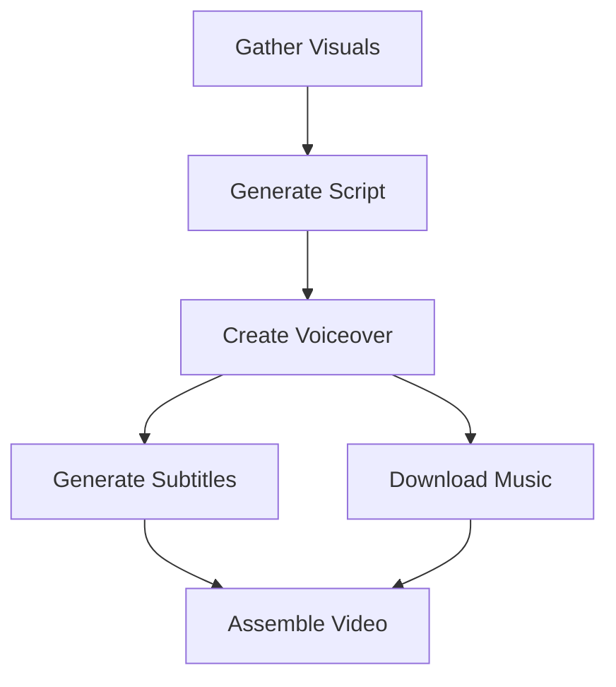

# ContentEngineAI

[](https://opensource.org/licenses/MIT)
[](https://www.python.org/downloads/release/python-312/)
[](https://github.com/astral-sh/ruff)
[](VERSIONING.md)

**Version**: 0.1.0
**License**: MIT
**Authors**: ContentEngineAI Team <stkzlv+ContentEngineAI@gmail.com>

> **⚠️ Pre-Production Software**: ContentEngineAI is under active development. While functional, breaking changes may occur in minor versions until 1.0.0. See [VERSIONING.md](VERSIONING.md) for our stability roadmap.

> **🚀 Initial Release**: ContentEngineAI v0.1.0 - Complete AI video production pipeline now available as open source! See [STATUS.md](STATUS.md) for current capabilities.

ContentEngineAI is an AI-powered pipeline for generating short, vertical (9:16) promotional videos for e-commerce products, primarily Amazon listings. It automates the entire process from scraping product data to assembling a final video, including AI script generation, stock media fetching, voiceover production, and subtitle generation.

## ✨ Key Features

- **🤖 End-to-End Automation**: Complete video production pipeline from data to final video
- **🌐 Multi-Platform Scraping**: Modular architecture supporting Amazon with extensible foundation
- **⚡ Parallel Processing**: Optimized pipeline with concurrent step execution
- **🎯 Multi-Provider Support**: Fallback mechanisms for AI services (OpenRouter, Google Cloud, local models)
- **📱 Vertical Video Optimized**: 9:16 aspect ratio perfect for social media platforms
- **🎨 Professional Quality**: Dynamic visuals, audio-synchronized subtitles, background music
- **🎤 High-Quality Voice**: Chirp 3 HD voices with perfect subtitle timing via Whisper STT
- **⚙️ Highly Configurable**: YAML-based configuration with 100+ customizable parameters

## 🚀 Quick Start

### Prerequisites
- Python 3.12+
- FFmpeg
- Poetry

### Installation

```bash
# Clone repository
git clone https://github.com/ContentEngineAI/ContentEngineAI.git
cd ContentEngineAI

# Install dependencies
poetry install
poetry run playwright install

# Setup API keys
cp .env.example .env
# Edit .env with your API keys
```

**📖 Detailed setup**: [INSTALL.md](INSTALL.md)

### Basic Usage

```bash
# Generate video for Amazon product (direct ASIN)
poetry run python -m src.scraper.amazon.scraper --keywords "B0BTYCRJSS" --debug --clean
poetry run python -m src.video.producer outputs/B0BTYCRJSS/data.json slideshow_images

# Search with advanced filters
poetry run python -m src.scraper.amazon.scraper \
  --keywords "wireless headphones" \
  --min-price 15.0 --max-price 100.0 \
  --min-rating 4 --prime-only \
  --sort price-asc-rank --debug --clean

# Batch processing - process all products in outputs directory
poetry run python -m src.video.producer --batch --batch-profile slideshow_images --debug
```

## 🏗️ Architecture Overview

ContentEngineAI follows a **6-step modular pipeline** with parallel execution:



**📖 Detailed architecture**: [ARCHITECTURE.md](ARCHITECTURE.md)

## 📚 Documentation

| Document | Description |
|----------|-------------|
| **[🛠️ INSTALL.md](INSTALL.md)** | Complete installation guide with API setup |
| **[⚙️ CONFIGURATION.md](CONFIGURATION.md)** | Comprehensive configuration reference |
| **[🏗️ ARCHITECTURE.md](ARCHITECTURE.md)** | Technical architecture and design patterns |
| **[🔧 TROUBLESHOOTING.md](TROUBLESHOOTING.md)** | Common issues and solutions |
| **[📊 STATUS.md](STATUS.md)** | Current project status and migrations |
| **[👨‍💻 DEVELOPMENT.md](DEVELOPMENT.md)** | Development guide and contribution instructions |
| **[🤝 CONTRIBUTING.md](CONTRIBUTING.md)** | How to contribute to the project |
| **[🧪 TESTING.md](TESTING.md)** | Comprehensive testing guide |
| **[✨ LINTING.md](LINTING.md)** | Code quality tools and best practices |

## 🛠️ Development

### Code Quality

```bash
# Run all quality checks
make lint

# Format code
make format

# Run tests
make test

# Security scan
make security
```

**📖 Detailed development guide**: [DEVELOPMENT.md](DEVELOPMENT.md)

## 🤝 Contributing

We welcome contributions! Please see our [Contributing Guide](CONTRIBUTING.md) for details on development setup, code style guidelines, testing requirements, and the pull request process.

```bash
# Quick start for contributors
git clone https://github.com/ContentEngineAI/ContentEngineAI.git
cd ContentEngineAI
poetry install --with dev
make install-dev
make test
```

## 📄 License

This project is licensed under the MIT License - see the [LICENSE](LICENSE) file for details.

---

<div align="center">

**[📖 Documentation](INSTALL.md)** • **[🛠️ Setup Guide](INSTALL.md)** • **[📊 Status](STATUS.md)** • **[🧪 Testing](TESTING.md)** • **[✨ Code Quality](LINTING.md)** • **[🤝 Contributing](CONTRIBUTING.md)** • **[🐛 Issues](https://github.com/ContentEngineAI/ContentEngineAI/issues)**

*Built with ❤️ for the e-commerce content creation community*

</div>