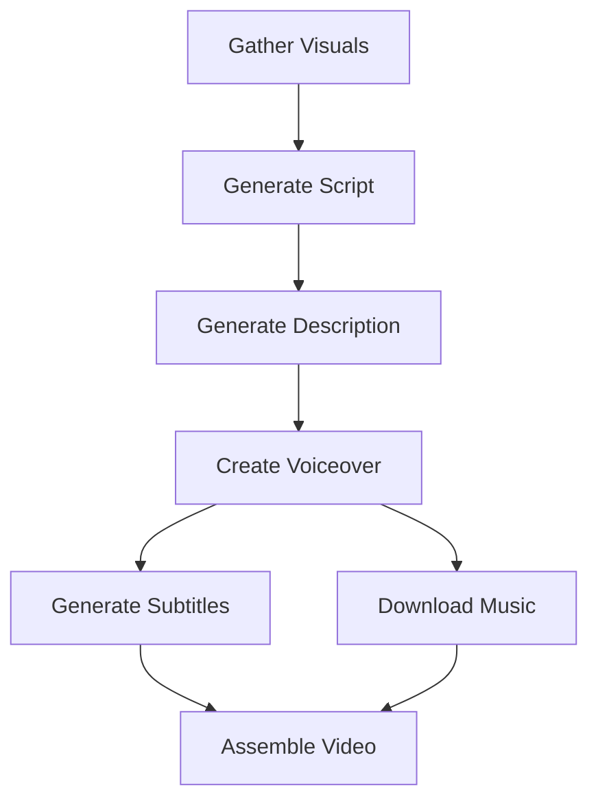

# ContentEngineAI

[](https://opensource.org/licenses/MIT)
[](https://www.python.org/downloads/release/python-312/)
[](https://github.com/astral-sh/ruff)
[](VERSIONING.md)

**Version**: 0.6.1 | **License**: MIT | **Status**: Pre-Production

> **🚀 Latest Update**: Added `slideshow_images2` profile with comprehensive subtitle configuration and CLI override support for image positioning.

**ContentEngineAI** is an AI-powered pipeline for generating short, vertical (9:16) promotional videos for e-commerce products. It automates the complete workflow from scraping product data to delivering final videos with AI-generated scripts, voiceovers, and content-aware subtitles.

## ✨ Key Features

- **🤖 End-to-End Automation**: Complete video production from scraping to final output
- **📱 Social Media Ready**: Vertical 9:16 format optimized for TikTok, Instagram, YouTube Shorts
- **🎨 Style Presets**: 5 production-ready presets (`minimal`, `modern`, `bold`, `animated`, `random`) with configurable effects
- **🎯 Content-Aware Subtitles**: Dynamic positioning that intelligently avoids visual content overlap
- **🎤 Premium Audio**: Google Chirp 3 HD voices with Whisper STT synchronization
- **⚙️ Production-Ready Config**: Modular YAML + CLI overrides + environment variables
- **🛡️ Multi-Provider Fallbacks**: OpenRouter, Google Cloud, local models for reliability

## 🚀 Quick Start

```bash
# 1. Setup (requires Python 3.12+, FFmpeg, Poetry)
git clone https://github.com/stkzlv/ContentEngineAI.git && cd ContentEngineAI
poetry install && poetry run playwright install
cp .env.example .env  # Configure API keys

# 2. Generate a video (30 seconds to first result)
poetry run python -m src.scraper.amazon.scraper --keywords "B0BTYCRJSS" --debug
poetry run python -m src.video.producer outputs/B0BTYCRJSS/data.json slideshow_images1 --preset random --debug

# 3. Batch process multiple products
poetry run python -m src.video.producer --batch --batch-profile slideshow_images1
```

**📖 Complete Guide**: [INSTALL.md](INSTALL.md) • **⚙️ Configuration**: [CONFIGURATION.md](CONFIGURATION.md)

## 🏗️ Architecture

<details>
<summary>Pipeline Overview</summary>

ContentEngineAI follows a **7-step modular pipeline** with parallel execution:


```mermaid
graph TD
    A[Gather Visuals] --> B[Generate Script]
    B --> C[Generate Description]
    C --> D[Create Voiceover]
    D --> E[Generate Subtitles]
    D --> F[Download Music]
    E --> G[Assemble Video]
    F --> G
```

**📖 Detailed architecture**: [ARCHITECTURE.md](ARCHITECTURE.md)
</details>

## 📚 Documentation

| Guide | Description |
|-------|-------------|
| **[🛠️ INSTALL.md](INSTALL.md)** | Complete installation and setup guide |
| **[⚙️ CONFIGURATION.md](CONFIGURATION.md)** | Complete configuration reference and options |
| **[🏗️ ARCHITECTURE.md](ARCHITECTURE.md)** | Technical architecture and system design |
| **[🔧 TROUBLESHOOTING.md](TROUBLESHOOTING.md)** | Solutions for common issues and debugging |

<details>
<summary><strong>Developer Documentation</strong></summary>

| Document | Purpose |
|----------|---------|
| **[👨‍💻 DEVELOPMENT.md](DEVELOPMENT.md)** | Development setup and contribution workflow |
| **[🧪 TESTING.md](TESTING.md)** | Testing framework and quality assurance |
| **[✨ LINTING.md](LINTING.md)** | Code quality standards and tools |
| **[🤝 CONTRIBUTING.md](CONTRIBUTING.md)** | How to contribute code and documentation |

</details>

## 🛠️ Development & Contributing

<details>
<summary><strong>Developer Quick Start</strong></summary>

```bash
# Setup development environment
git clone https://github.com/stkzlv/ContentEngineAI.git && cd ContentEngineAI
poetry install --with dev && make install-dev

# Quality assurance commands
make lint      # Complete quality check (7 tools)
make test      # Full test suite with coverage
make security  # Security vulnerability scan
```

**📖 Complete guide**: [DEVELOPMENT.md](DEVELOPMENT.md) • [CONTRIBUTING.md](CONTRIBUTING.md)

</details>

---

## 📄 License

**MIT License** - see [LICENSE](LICENSE) for details

<div align="center">

**[🛠️ Installation](INSTALL.md)** • **[⚙️ Configuration](CONFIGURATION.md)** • **[🤝 Contributing](CONTRIBUTING.md)** • **[🐛 Issues](https://github.com/stkzlv/ContentEngineAI/issues)**

</div>
