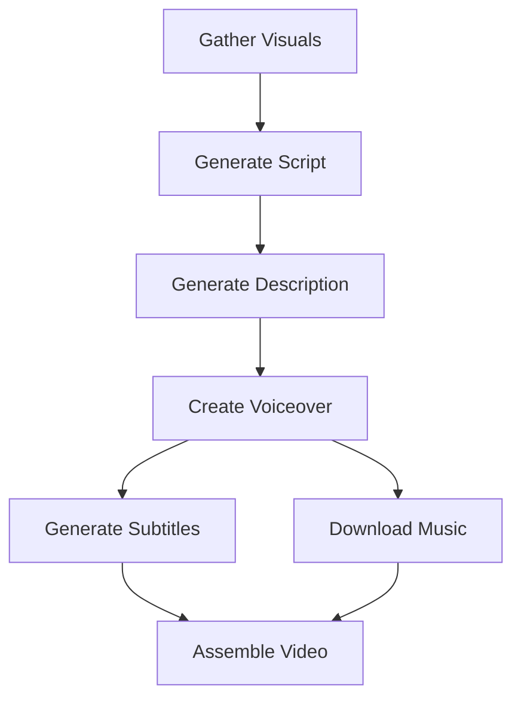

# ContentEngineAI

[](https://opensource.org/licenses/MIT)
[](https://www.python.org/downloads/release/python-312/)
[](https://github.com/astral-sh/ruff)
[](VERSIONING.md)

**Version**: 0.3.1
**License**: MIT
**Authors**: ContentEngineAI Team <stkzlv+ContentEngineAI@gmail.com>

> **⚠️ Pre-Production Software**: ContentEngineAI is under active development. While functional, breaking changes may occur in minor versions until 1.0.0. See [VERSIONING.md](VERSIONING.md) for our stability roadmap.

> **🚀 Latest Release**: ContentEngineAI v0.3.1 - Optimized style preset system with RANDOM preset for maximum variety in video styling! See [STATUS.md](STATUS.md) for current capabilities and ongoing development.

ContentEngineAI is an AI-powered pipeline for generating short, vertical (9:16) promotional videos for e-commerce products, primarily Amazon listings. It automates the entire process from scraping product data to assembling a final video, including AI script generation, stock media fetching, voiceover production, and subtitle generation.

## ✨ Key Features

- **🤖 End-to-End Automation**: Complete video production pipeline from data to final video
- **📱 Vertical Video Optimized**: 9:16 aspect ratio perfect for social media platforms
- **🎨 Style Preset System**: 4 optimized presets (minimal, modern, bold, random) with deterministic effects
- **🎯 Content-Aware Subtitles**: Dynamic positioning that avoids overlapping with visual content
- **🎤 High-Quality Voice**: Chirp 3 HD voices with perfect subtitle timing via Whisper STT
- **⚡ Parallel Processing**: Optimized pipeline with concurrent step execution
- **🎯 Multi-Provider Support**: Fallback mechanisms for AI services (OpenRouter, Google Cloud, local models)
- **⚙️ Highly Configurable**: YAML-based configuration with 100+ customizable parameters

## 🚀 Quick Start

**Prerequisites**: Python 3.12+, FFmpeg, Poetry

```bash
# Install and setup
git clone https://github.com/stkzlv/ContentEngineAI.git && cd ContentEngineAI
poetry install && poetry run playwright install
cp .env.example .env  # Add your API keys

# Generate a video
poetry run python -m src.scraper.amazon.scraper --keywords "B0BTYCRJSS" --debug --clean
poetry run python -m src.video.producer outputs/B0BTYCRJSS/data.json slideshow_images1 --preset random
```

**📖 Complete setup and usage**: [INSTALL.md](INSTALL.md) • [CONFIGURATION.md](CONFIGURATION.md)

## 🏗️ Architecture

<details>
<summary>Pipeline Overview</summary>

ContentEngineAI follows a **7-step modular pipeline** with parallel execution:


```mermaid
graph TD
    A[Gather Visuals] --> B[Generate Script]
    B --> C[Generate Description]
    C --> D[Create Voiceover]
    D --> E[Generate Subtitles]
    D --> F[Download Music]
    E --> G[Assemble Video]
    F --> G
```

**📖 Detailed architecture**: [ARCHITECTURE.md](ARCHITECTURE.md)
</details>

## 📚 Documentation

| Document | Description |
|----------|-------------|
| **[🛠️ INSTALL.md](INSTALL.md)** | Complete installation guide with API setup |
| **[⚙️ CONFIGURATION.md](CONFIGURATION.md)** | Comprehensive configuration reference |
| **[🏗️ ARCHITECTURE.md](ARCHITECTURE.md)** | Technical architecture and design patterns |
| **[🔧 TROUBLESHOOTING.md](TROUBLESHOOTING.md)** | Common issues and solutions |
| **[📊 STATUS.md](STATUS.md)** | Current project status and migrations |
| **[👨‍💻 DEVELOPMENT.md](DEVELOPMENT.md)** | Development guide and contribution instructions |
| **[🤝 CONTRIBUTING.md](CONTRIBUTING.md)** | How to contribute to the project |
| **[🧪 TESTING.md](TESTING.md)** | Comprehensive testing guide |
| **[✨ LINTING.md](LINTING.md)** | Code quality tools and best practices |

## 🛠️ Development

<details>
<summary>Code Quality Commands</summary>

```bash
make lint      # Run all quality checks
make format    # Format code
make test      # Run tests
make security  # Security scan
```

**📖 Detailed development guide**: [DEVELOPMENT.md](DEVELOPMENT.md)
</details>

## 🤝 Contributing

<details>
<summary>Quick Start for Contributors</summary>

```bash
git clone https://github.com/stkzlv/ContentEngineAI.git && cd ContentEngineAI
poetry install --with dev && make install-dev && make test
```

**📖 Complete guide**: [CONTRIBUTING.md](CONTRIBUTING.md)
</details>

## 📄 License

This project is licensed under the MIT License - see the [LICENSE](LICENSE) file for details.

---

<div align="center">

**[📖 Documentation](INSTALL.md)** • **[🛠️ Setup Guide](INSTALL.md)** • **[📊 Status](STATUS.md)** • **[🧪 Testing](TESTING.md)** • **[✨ Code Quality](LINTING.md)** • **[🤝 Contributing](CONTRIBUTING.md)** • **[🐛 Issues](https://github.com/stkzlv/ContentEngineAI/issues)**

*Built with ❤️ for the e-commerce content creation community*

</div>