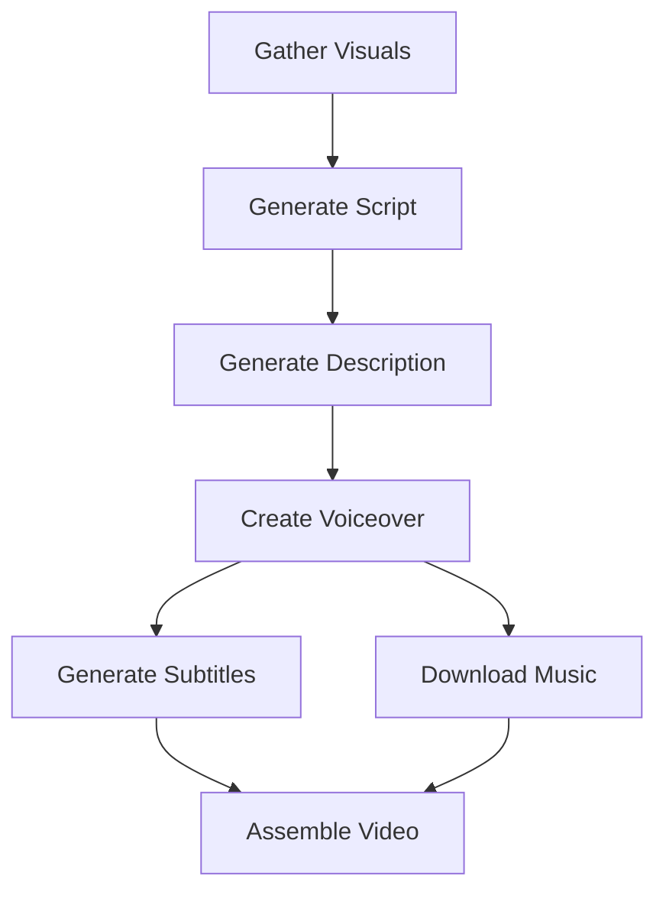

# ContentEngineAI

[](https://opensource.org/licenses/MIT)
[](https://www.python.org/downloads/release/python-312/)
[](https://github.com/astral-sh/ruff)
[](docs/versioning.md)

**Version**: 0.19.1 | **License**: MIT | **Status**: Pre-Production

> **🚀 Latest Update (v0.19.1)**: Documentation reorganized to `docs/` directory. Specs consolidated into unified module specs with retry logic.

**ContentEngineAI** is an AI-powered pipeline for generating short, vertical (9:16) promotional videos for e-commerce products. It automates the complete workflow from scraping product data to delivering final videos with AI-generated scripts, voiceovers, and content-aware subtitles.

## ✨ Key Features

- **🤖 End-to-End Automation**: Complete video production from scraping to publishing
- **📤 Social Media Publishing**: Auto-scheduling with slot detection + cleanup after publish
- **📦 Batch Processing**: Process hundreds of products with unified scrape + produce + publish pipeline
- **🎲 Smart Randomization**: Deterministic profile selection with configurable pools
- **📱 Social Media Ready**: Vertical 9:16 format optimized for TikTok, Instagram, YouTube Shorts
- **🎯 Platform-Specific Metadata**: AI-generated titles, captions, hashtags + ready-to-post instructions
- **🎥 Product Video Assembly**: 4 modes with aspect ratio handling and audio control
- **🎯 Content-Aware Subtitles**: Dynamic positioning with CTA-synchronized dual-line support
- **🎤 Premium Audio**: Google Chirp 3 HD voices with Whisper STT synchronization
- **⚙️ Production-Ready Config**: Modular YAML + CLI overrides + environment variables

## 🚀 Quick Start

```bash
# 1. Setup (requires Python 3.12+, FFmpeg, Poetry)
git clone https://github.com/stkzlv/ContentEngineAI.git && cd ContentEngineAI
poetry install && poetry run playwright install
cp .env.example .env  # Configure API keys

# 2. Generate a video (30 seconds to first result)
poetry run python -m src.scraper.amazon.scraper --keywords "B0BTYCRJSS" --debug
poetry run python -m src.video.producer outputs/B0BTYCRJSS/data.json slideshow_images1 --preset random --debug

# 3. Generate with platform-specific metadata (YouTube, TikTok, Instagram)
poetry run python -m src.video.producer outputs/B0BTYCRJSS/data.json slideshow_images1 --target-platform multi --debug

# 4. Unified batch pipeline (scrape + produce + publish in one command)
poetry run python -m src.pipeline.global_batch \
  --keywords "wireless earbuds" \
  --profile slideshow_images1 \
  --platforms youtube tiktok \
  --debug
```

**📖 Complete Guide**: [Installation](docs/installation.md) • **⚙️ Configuration**: [Configuration](docs/configuration.md)

## 🔄 Batch Processing

Process multiple products with unified scrape + produce + publish pipeline:

```bash
# End-to-end batch automation with auto-scheduling
poetry run python -m src.pipeline.global_batch \
  --keywords "wireless earbuds" \
  --profile slideshow_images1 \
  --platforms youtube tiktok \
  --debug
```

**Auto-Scheduling**: Finds first available unoccupied slot in recurring schedule by querying Late.co API. Falls back to immediate publish if all slots occupied within 8-week lookahead.

**📖 Complete Guide**: [Batch Processing](docs/batch-processing.md) - Multi-mode batch workflows, filters, randomization, publishing

## 📤 Social Media Publishing

Automatically publish generated videos to social media platforms:

```bash
# 1. Setup Late.dev credentials in .env
echo "LATE_API_KEY=sk_live_your_key" >> .env

# 2. List connected accounts
poetry run python -m src.publisher.late list-accounts

# 3. Publish a video immediately
poetry run python -m src.publisher.late single \
  --video outputs/B0BTYCRJSS/video_B0BTYCRJSS_sequential.mp4 \
  --platform youtube --platform tiktok \
  --immediate --debug

# 4. Batch publish all videos
poetry run python -m src.publisher.late batch \
  --platform youtube --platform tiktok --platform instagram \
  --immediate --debug
```

**Platform-Specific Content**: When metadata files (`metadata_youtube.json`, `metadata_tiktok.json`, `metadata_instagram.json`) exist, the publisher creates separate posts for each platform with optimized content.

**Auto-Cleanup**: Product directories are automatically removed after successful multi-platform publish (configurable in `config/publisher.yaml`).

**📖 Complete Guide**: [Publisher](docs/publisher.md) - Setup, auto-scheduling, cleanup, CLI commands, configuration

## 🏗️ Architecture

<details>
<summary><strong>Pipeline Overview</strong></summary>

ContentEngineAI follows a **7-step modular pipeline** with parallel execution:


```mermaid
graph TD
    A[Gather Visuals] --> B[Generate Script]
    B --> C[Generate Description]
    C --> D[Create Voiceover]
    D --> E[Generate Subtitles]
    D --> F[Download Music]
    E --> G[Assemble Video]
    F --> G
```

**📖 Detailed architecture**: [Architecture](docs/architecture.md)

</details>

## 📚 Documentation

### Core Documentation

| Guide | Description |
|-------|-------------|
| **[🛠️ Installation](docs/installation.md)** | Complete installation and setup guide |
| **[⚙️ Configuration](docs/configuration.md)** | Configuration reference and options |
| **[🔄 Batch Processing](docs/batch-processing.md)** | Batch processing workflows and automation |
| **[📤 Publisher](docs/publisher.md)** | Social media publishing via Late.dev |
| **[🏗️ Architecture](docs/architecture.md)** | Technical architecture and system design |
| **[🔧 Troubleshooting](docs/troubleshooting.md)** | Solutions for common issues and debugging |

<details>
<summary><strong>Developer Documentation</strong></summary>

| Document | Purpose |
|----------|---------|
| **[👨‍💻 Development](docs/development.md)** | Development setup and contribution workflow |
| **[🧪 Testing](docs/testing.md)** | Testing framework and quality assurance |
| **[✨ Linting](docs/linting.md)** | Code quality standards and tools |
| **[🤝 Contributing](CONTRIBUTING.md)** | How to contribute code and documentation |

</details>

## 🛠️ Development & Contributing

<details>
<summary><strong>Developer Quick Start</strong></summary>

```bash
# Setup development environment
git clone https://github.com/stkzlv/ContentEngineAI.git && cd ContentEngineAI
poetry install --with dev && make install-dev

# Quality assurance commands
make lint      # Complete quality check (7 tools)
make test      # Full test suite with coverage
make security  # Security vulnerability scan
```

**📖 Complete guide**: [Development](docs/development.md) • [Contributing](CONTRIBUTING.md)

</details>

---

## 📄 License

**MIT License** - see [LICENSE](LICENSE) for details

<div align="center">

**[🛠️ Installation](docs/installation.md)** • **[⚙️ Configuration](docs/configuration.md)** • **[🔄 Batch Processing](docs/batch-processing.md)** • **[📤 Publishing](docs/publisher.md)** • **[🤝 Contributing](CONTRIBUTING.md)** • **[🐛 Issues](https://github.com/stkzlv/ContentEngineAI/issues)**

</div>
