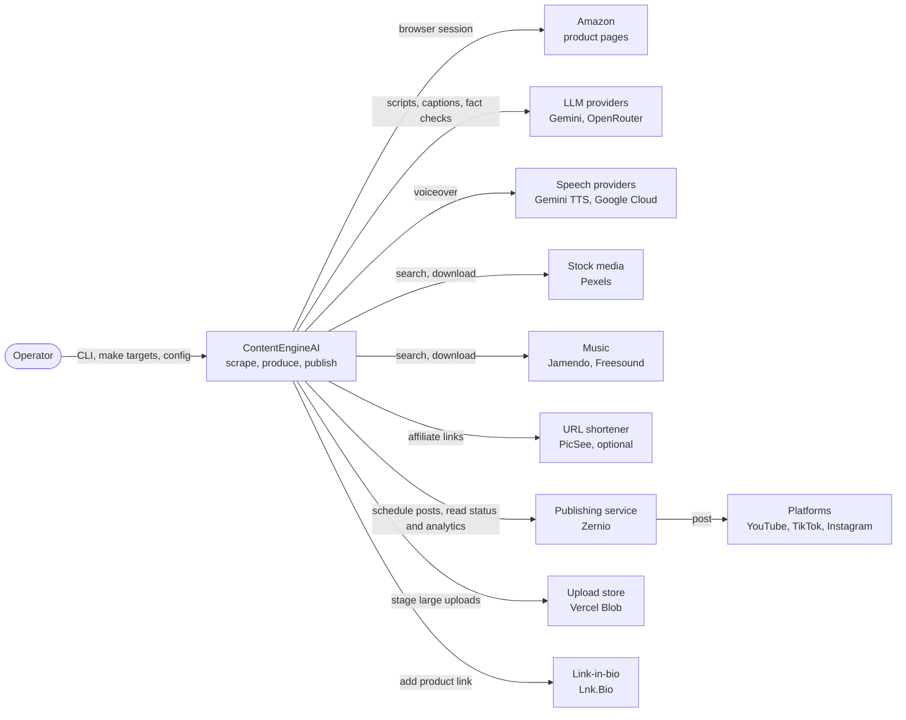
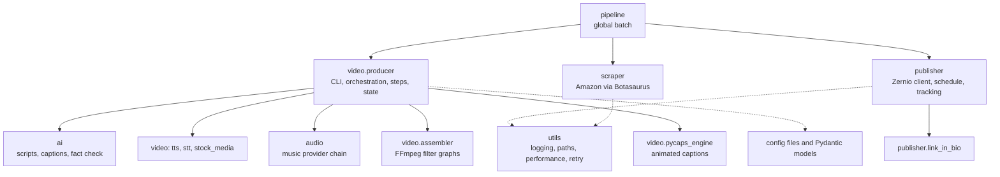
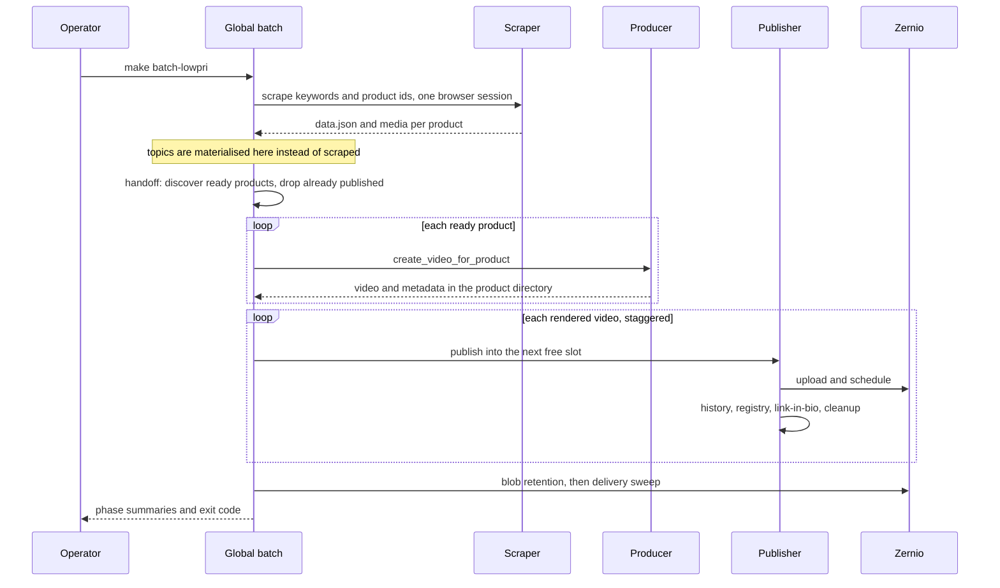
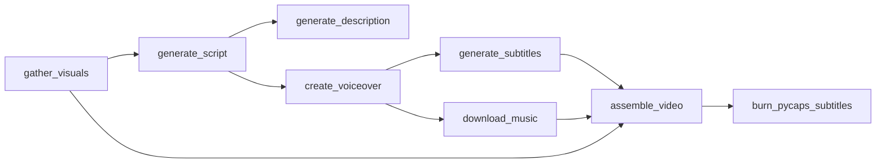
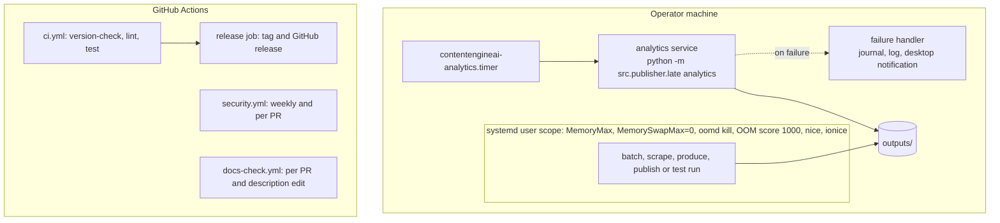

# Architecture

How ContentEngineAI fits together, in the [arc42](https://arc42.org/overview) sections with [C4](https://c4model.com/) diagrams. This page follows the code: a change that moves a module, a step or a boundary updates it in the same pull request. Why the documentation is split this way is in [decision 0001](decisions/0001-documentation-structure.md), and [the documentation map](README.md) says where everything else lives.

## 1. Introduction and goals

ContentEngineAI turns a product listing or a topic into a short vertical video with a voiceover, captions and music, and schedules it on social platforms. One operator runs it on one machine, either step by step (scrape, produce, publish) or as one global batch.

What it must do is in [the requirements](requirements/README.md); where it is going is in [the roadmap](roadmap.md).

Top quality goals, in priority order:

| Goal | What it means here |
|---|---|
| Compliance | Every render and post that carries a material connection discloses it, on the frame and in the caption, and the two never disagree. |
| Unattended reliability | A batch survives one bad product, a provider outage and an interruption: failures are isolated per item, providers fall back, and `--resume` continues from the last checkpoint. |
| Reproducibility | A product renders the same way on every run: choices are seeded from the product id and recorded in the run state. |
| Coexistence with the desktop | A render or a scrape runs beside the operator's own work without the machine killing either. |

Stakeholders:

| Who | Expects |
|---|---|
| Operator | Runs the pipeline, configures profiles and accounts, reads logs and summaries, decides when held features turn on. |
| Contributor | Changes a module without breaking the other entry point that re-implements it, and finds the reason behind a guard before removing it. |

## 2. Constraints

| Constraint | Consequence |
|---|---|
| Python 3.12, managed with Poetry | One interpreter version; the `*-lowpri` targets resolve the project interpreter themselves (section 7). |
| FFmpeg and FFprobe on `PATH` | All assembly, probing and the fallback caption burn go through FFmpeg subprocesses. |
| Optional pycaps engine with Playwright and Chromium | The bundled caption engine needs about 1 GB of browser; without it a render falls back to FFmpeg captions ([decision 0004](decisions/0004-caption-engine.md)). |
| Botasaurus driving a real Chromium | The scraper needs a display (or Xvfb) and runs one browser session per scrape. |
| One machine, shared with a desktop session | A render's process tree peaks near 4 GB for image profiles and 4.1-4.3 GB for stock ones; full runs go through the memory-capped `*-lowpri` targets. |
| Third-party APIs with quotas and outages | Every provider call has retries, a circuit breaker or a fallback provider, and runs inside a time budget. |
| Publishing through one scheduling service | The pipeline never talks to YouTube, TikTok or Instagram directly; it reads post status back from the service. |
| Public repository with private overlays | Public docs and config ship generic defaults; account-specific values live in `.env` and gitignored `*.private.*` files. |

## 3. Context and scope

The system boundary is the repository's code running on the operator's machine. Everything else is an external system reached over HTTP or a browser.

Speech-to-text (Whisper) runs locally, so it is inside the boundary. A batch can also post phase events to an operator-configured webhook (`config/pipeline.yaml`).

## 4. Solution strategy

| Choice | Why | Record |
|---|---|---|
| Three standalone modules plus one batch orchestrator | Each phase is usable and debuggable on its own; the batch chains them for unattended runs. | Section 5 |
| The filesystem is the interface between phases | The scraper writes `outputs/<id>/data.json` and media, the producer writes the video and metadata beside them, and the publisher reads that directory. No database, no queue. | Section 8 |
| A render is a dependency graph of eight resumable steps | Independent steps run in parallel, and a failed or interrupted render resumes from the last valid step. | Section 6 |
| Provider chains with fallbacks | One outage degrades a render instead of failing it. | Section 8 |
| Pycaps with the CSS renderer for captions, FFmpeg as fallback | Animated word-level captions, without making Chromium a hard dependency. | [0004](decisions/0004-caption-engine.md) |
| Four configuration tiers | Behaviour lives in reviewed YAML and profiles; the environment holds secrets and machine settings. | [0003](decisions/0003-config-precedence.md) |
| Output-changing features ship off | Keeps format comparisons attributable. | [0002](decisions/0002-output-changes-ship-off-by-default.md) |
| Duplicates from explicit actions are tolerated | Guards stop accidental duplicates; `--force` is an expected outcome. | [0005](decisions/0005-duplicates-are-tolerated.md) |

## 5. Building block view

The containers are the packages under `src/`. Arrows read "calls".

Every module also uses `utils` and the config layer; the dotted lines stand for all of those edges.

### Pipeline (global batch)

`src/pipeline/global_batch.py::GlobalPipelineOrchestrator` runs the scraping, handoff, production and publishing phases in order. Each phase is a module in `src/pipeline/phases/` (`scraping.py`, `production.py`, `publishing.py`), and the batch's settings and checkpoint live in `src/pipeline/config.py` (`GlobalBatchConfig`, `PipelineState`). `src/pipeline/cli.py` parses arguments, `plan.py` prints the dry-run plan, and `webhooks.py` sends the optional phase notifications. Entry point: `python -m src.pipeline` or `make batch-lowpri`. The phases call the modules' functions directly rather than their CLIs, which is where the drift in [batch-alignment.md](notes/batch-alignment.md) comes from.

### Scraper

`src/scraper/amazon/scraper.py::BotasaurusAmazonScraper` drives one Chromium session per run, with `cli.py` as the command line and `batch_controller.py` for multi-input runs. Extraction is split by concern: `product_extractor.py`, `media_extractor.py`, `video_extractor.py` (page data, thumbnail clicks with stream capture, then DOM elements), and validation in `media_validator.py`. `src/scraper/base/` holds the platform-neutral models, `BaseScraper`, `ScraperRegistry`, throttling and keyword pillars. `ScraperFactory` in `src/scraper/__init__.py` exists, but no pipeline code uses it; the batch imports the Amazon scraper directly, and Amazon is the only platform. Entry point: `python -m src.scraper.amazon.scraper`. Notes: [scraper.md](notes/scraper.md).

### Producer

`src/video/producer/` renders one product or topic, or a batch of them. `cli.py` parses arguments and discovers products, `orchestration.py::create_video_for_product` runs one render, `steps.py` holds the eight step functions, `state.py` reads and writes `pipeline_state.json`, `context.py` defines `PipelineContext`, and `artifact_registry.py` reloads a skipped step's outputs. `topic_input.py` builds a topic record in place of a scraped one, and `utils.py::collect_producer_secrets` builds the secrets for both entry points. The graph executor is `src/video/pipeline_graph.py::PipelineGraph`. Entry point: `python -m src.video.producer` or `make produce-lowpri`. Notes: [video.md](notes/video.md).

### Speech, captions and stock media

`src/video/tts.py` synthesises the voiceover (Gemini TTS, then Google Cloud TTS; Coqui is supported but not installed). `src/video/stt_functions.py` transcribes it with Whisper for word timings, with Google Cloud STT and script-based timing as fallbacks on the FFmpeg engine. `src/video/subtitle_utils.py` and `unified_subtitle_generator.py` write SRT or ASS; `src/video/pycaps_engine/renderer.py` burns animated captions after assembly. `src/video/stock_media.py` searches and downloads Pexels media, and `stock_relevance.py` scores each candidate's thumbnail with a multimodal model. Notes: [subtitles.md](notes/subtitles.md).

### Assembler

`src/video/assembler/core.py::VideoAssembler` builds one FFmpeg command from builders: `visual_builder.py` (images, videos, aspect fits), `video_strategies.py` (the assembly modes), `subtitle_builder.py`, `overlay_builder.py` (disclosure, hook and upper-line overlays), `audio_builder.py` (voiceover and music mix) and `media_inspector.py` (probing). It is called by the `assemble_video` step only. Notes: [video.md](notes/video.md).

### AI

`src/ai/llm_client.py` dispatches to Gemini or OpenRouter as `llm_settings.py` configures; `model_pool.py` discovers and filters free OpenRouter models for the fallback provider. `script_generator.py` writes the script from the templates in `src/ai/prompts/`, `script_fact_check.py` checks it against the product data, and `description_generator.py` with `platform_metadata/` writes the per-platform captions and titles. Called by the `generate_script` and `generate_description` steps. Notes: [video.md](notes/video.md).

### Audio

`src/audio/manager.py::AudioManager` tries the providers registered in `registry.py` (`jamendo_provider.py`, then `freesound_provider.py`) in the order of `audio_providers`, inside a time budget, and falls back to local files. Called by the `download_music` step. Notes: [audio.md](notes/audio.md).

### Publisher

The publisher lives in `src/publisher/`. `late/client.py::LatePublisher` is the only `BasePublisher` implementation; `registry.py::create_publisher_from_config` builds it for both the CLI and the batch. `schedule.py::ScheduleManager` finds free slots, `tracking.py` writes the publish history, `product_registry.py` the published-products registry, `cleanup.py` removes published product directories, `analytics.py` captures per-post figures, and `blob_retention.py` and `partial_post_sweep.py` are the post-publish sweeps. `link_in_bio/manager.py::LinkInBioManager` adds the product link through `lnkbio.py`. Entry point: `python -m src.publisher.late` with subcommands such as `single`, `schedule` and `analytics`. Notes: [publisher.md](notes/publisher.md), [link-in-bio.md](notes/link-in-bio.md).

### Content research

`src/research/` measures what the configuration should change and is not part of any render ([design 0023](design/0023-content-research.md)). `sources.py` wraps Google Trends (pytrends, the optional `research` group) and Google autocomplete, paced and retried, and the Wikipedia pageviews and Stack Exchange APIs; `demand.py` turns their readings into shares of an anchor term, trends, peak months and drop and add candidates; `sample.py` runs the producer's script step in memory for each variant into a scratch outputs root; `checks.py` measures the samples; `verify.py` checks each topic script's steps with one grounded Gemini call; `recommend.py` turns the measurements into recommended config changes; `report.py` renders the report; `__main__.py` is the command line (`python -m src.research`). It reads `config/research.yaml`, the scraper keywords and the topic pool, and writes under `outputs/reports/`. Reference: [research.md](reference/research.md).

### Utilities and configuration

`src/utils/` holds the cross-cutting pieces: `logging_setup.py`, `outputs_paths.py`, `performance.py`, `retry.py`, `circuit_breaker.py`, `connection_pool.py`, `pipeline_deadline.py`, `secrets.py` and the `url_shortener/` package (`bare`, the default no-op, and PicSee). `src/config_manager.py::UnifiedConfigManager` loads the YAML files and applies the environment and CLI tiers; `src/video/config/` and `src/scraper/config_models.py` hold the Pydantic models. Notes: [ci-and-dependencies.md](notes/ci-and-dependencies.md).

## 6. Runtime view

### Global batch run

After each phase the batch writes `outputs/.pipeline_state.json` and, when configured, posts a webhook event. `--resume` reloads that file and skips completed phases; the handoff always runs again, so the already-published filter applies to a resumed run too. A completed run deletes the state file. Production and publishing isolate failures per product unless `--fail-fast` is passed.

### Single render

The producer resolves the profile's step order and runs the steps as a graph. Steps on the same level run concurrently.

A profile that draws no scraped media reverses the first edge: `generate_script` runs first so the stock search can use terms from the narration, and the description and voiceover steps then wait for both. `step_dependencies` in `src/video/producer/orchestration.py` is the single declaration of this graph; [the video pipeline explanation](explanation/video-pipeline.md) gives the reasons. `burn_pycaps_subtitles` returns at once when the resolved engine isn't pycaps, and falls back to an FFmpeg burn when pycaps fails.

The whole render runs inside `pipeline_timeout_sec`; `src/utils/pipeline_deadline.py` passes the remaining budget down so a step's own timeout never outlasts the render's.

### Resume and per-step state

Each render keeps `pipeline_state.json` in its product's `temp/` directory, one entry per completed step with the artifact paths it wrote, plus the seeded choices (template, CTA, cold-open variant and others) that make the render reproducible. On start, `state.py::_load_pipeline_state` checks every recorded artifact; the first missing or invalid one truncates the state to the steps before it, in the profile's real order, and the render continues from there. Running one step with `--step` drops the recorded steps that read its output, so a later full run doesn't reuse stale results. A successful run without `--debug` deletes `temp/`, state included, so resume applies to failed and interrupted renders.

## 7. Deployment view

- **Low-priority targets.** `make batch-lowpri`, `scrape-lowpri`, `produce-lowpri`, `publish-lowpri` and `test-lowpri` start the run in a `systemd-run --user --scope` with `MemoryMax=$(MEM_LIMIT)` (default 6G), `MemorySwapMax=0`, `nice` and `ionice`. A blow-up is then killed inside the scope instead of the host's out-of-memory handling killing desktop applications. The cap does not help when the machine is already short, so the scope also sets `ManagedOOMMemoryPressure=kill` (systemd-oomd kills the scope under sustained pressure) and runs the command through `choom -n 1000`, which makes it the kernel OOM killer's first choice; a scope takes no `OOMScoreAdjust`, and Chrome marks its tabs 300. Before each render the producer also waits for free memory (`memory_guard`). All of it is the `LOWPRI_SCOPE` variable in the Makefile. The recipes exec the project interpreter directly instead of `poetry run`, because the scope doesn't carry the caller's virtualenv. Without `systemd-run` they refuse to run; `ALLOW_UNCAPPED=1` runs them with `nice` and `ionice` alone.
- **Analytics timer.** `deploy/install-timer.sh` (through `make install-analytics-timer`) renders the unit templates in `deploy/`, installs them as user units and runs one sweep. The timer runs the analytics sweep daily by default (`ON_CALENDAR` in `deploy/schedule.env`), and an `OnFailure=` unit records failures. [The publishing guide](guides/publishing.md) covers setup.
- **CI and releases.** Every pull request is a release: `version-check` runs `tools/release_check.py` against the base branch. On a push to `main`, the `release` job in `ci.yml` tags the version from `pyproject.toml` and creates the GitHub release from the CHANGELOG section. `release.yml` covers a tag pushed by hand. [Versioning](versioning.md) has the rules. `docs-check.yml` runs `tools/check_docs.py` on each pull request, and the `test` job runs only `make test-docs` when that tool reports a docs-only diff.

## 8. Cross-cutting concepts

### Configuration tiers

[Decision 0003](decisions/0003-config-precedence.md) sets four tiers, highest first: CLI flags, the machine environment, the profile, the YAML files under `config/`. The environment holds only secrets and three machine settings (`CONTENT_ENGINE_OUTPUT`, `OUTPUTS_DIR`, `FFMPEG_THREADS`), none of which a profile can set, so applying them when the YAML loads keeps them above the profile. `UnifiedConfigManager` merges the YAML files, applies a fixed map of environment variables, then the CLI overrides; `VideoConfig.get_profile_merged_settings` then merges the chosen profile under the CLI overrides. Secrets come from `.env` or the environment and never from YAML. The key-by-key reference is [Configuration](reference/configuration.md).

### Logging, run ids and product ids

`src/utils/logging_setup.py` writes one file per component per day under `outputs/logs/` and keeps 45 days. Every line carries the run id and the product id, bound with `log_context`, so one product's whole story across phases is one `grep`. A masking filter removes secret-shaped values, and third-party loggers stay quiet even with `--debug`.

### Error handling

Failures are contained at three levels. A provider call retries transient errors with backoff (`src/utils/retry.py`) and stops calling a failing service for a cool-down (`circuit_breaker.py`). A provider chain falls back to the next provider:

| Need | Chain |
|---|---|
| Script and captions | Gemini, then OpenRouter free models |
| Voiceover | Gemini TTS, then Google Cloud TTS |
| Word timings | Whisper, then Google Cloud STT, then timing estimated from the script (FFmpeg engine only) |
| Music | Jamendo, then Freesound, then local files |
| Captions | pycaps, then FFmpeg |
| Short links | the configured shortener, then the original URL |

A batch isolates failures per product and reports skips (insufficient media) apart from failures, and `--strict` turns any loss into a non-zero exit.

### Performance tracking

`src/utils/performance.py::PerformanceMonitor` measures each step's duration, process-tree memory and CPU, and `PerformanceHistoryManager` appends one record per render to `outputs/performance_history/`. `tools/performance_report.py` reads it. Requirements `REQ-OPS-047` to `REQ-OPS-065` define what is recorded.

### Outputs and state directories

All artifacts live under one outputs root (`outputs/` by default). Each product or topic has its own directory with `data.json`, media, a `temp/` working directory and the final `video_*.mp4`; the shared directories (`cache/`, `logs/`, `reports/`, `performance_history/`, `temp/`) sit beside them. `outputs/state/` holds the records that must outlive product cleanup (`publish_history.json`, `schedule.json`, the published-products registry and the analytics metrics); code reaches it through `src/utils/outputs_paths.py::durable_state_path`, and cleanup never removes it.

### Off-by-default features and seeded choices

A feature that changes rendered output ships behind a switch ([decision 0002](decisions/0002-output-changes-ship-off-by-default.md)), and `tests/test_reach_test_holdout.py` checks the bundled config keeps each `held` one off; the reach-test hold itself ended once its posts were queued ([decision 0014](decisions/0014-the-reach-test-hold-ends-when-its-posts-are-queued.md)). Choices drawn per render use a salted hash of the product id, so a product renders identically on every run, and the choice is written to the run state.

### Disclosure

The material-connection decision is made once, by the producer, and recorded in the render's metadata. The assembler burns the on-frame overlay from it, and the publisher reads it to lead the caption with the disclosure. The token is recorded beside it, the disclosure text resolved for the voice's language (`disclosure_overlay.variants`, falling back to `text`), so the frame and the caption carry the same text. When the record doesn't positively show there is nothing to disclose, both disclose. The rules are in [the compliance requirements](requirements/compliance.md) and [the compliance explanation](explanation/compliance.md).

## 9. Architecture decisions

| Record | Decision |
|---|---|
| [0001](decisions/0001-documentation-structure.md) | Documentation is split into folders by layer. |
| [0002](decisions/0002-output-changes-ship-off-by-default.md) | Output-changing features ship off by default. |
| [0003](decisions/0003-config-precedence.md) | Four configuration tiers; the environment holds machine settings and secrets. |
| [0004](decisions/0004-caption-engine.md) | Pycaps with the CSS renderer is the caption engine. |
| [0005](decisions/0005-duplicates-are-tolerated.md) | Duplicate posts from normal operation are tolerated. |
| [0014](decisions/0014-the-reach-test-hold-ends-when-its-posts-are-queued.md) | The reach-test hold ends once its posts are queued. |

Decision records are append-only. How a single feature works is in a design doc under [design/](design/README.md), frozen once the feature ships.

## 10. Quality requirements

| Quality | Measure | Requirements |
|---|---|---|
| Timing | The final video matches the voiceover within `video_duration_tolerance_sec` (default 1 s). | `REQ-VID-001`, `REQ-VID-002` |
| Time budget | A render stops at `pipeline_timeout_sec`, and final assembly has its own timeout inside it. | `REQ-VID-008`, `REQ-VID-009` |
| Memory | A run over `MEM_LIMIT` (default 6G) is stopped without other applications being killed. | `REQ-OPS-040` |
| Resumability | `--resume` continues a batch without redoing completed phases or products. | `REQ-BAT-043` |
| Exit status | A batch exits non-zero when nothing completes, and with `--strict` when anything is lost. | `REQ-BAT-048` to `REQ-BAT-051` |
| Observability | Every log line carries run and product ids; logs are kept 45 days. | `REQ-OPS-027`, `REQ-OPS-028` |
| Compliance | Caption and frame disclosure follow one decision. | `REQ-CMP-001` to `REQ-CMP-010` |

The full list, with statuses, is in [the requirements](requirements/README.md).

## 11. Risks and technical debt

- **Batch and module drift.** The batch phases re-implement parts of the standalone CLIs (scheduling, cleanup, filters, profile pools), and a fix in one path silently misses the other. [batch-alignment.md](notes/batch-alignment.md) lists where they drifted; the rule is to check the other path on every change.
- **Environment tier placement.** The environment is applied to the YAML layer before the profile merges, so its place above the profile rests on no machine setting being one a profile can set. A test checks that; a new machine setting a profile also carries would need a second merge.
- **Partial requirements.** Requirements marked `partial` name their gaps: among them `REQ-VID-090` (every cold-open variant renders the same way). The requirements files list every one with its `Gap:` line.
- **Dead or speculative structure.** `ScraperFactory`, `MultiPlatformScraper` and the non-Amazon `Platform` values have no caller.
- **Link-in-bio window.** The provider's list endpoint returns one page, so the duplicate check sees only recent links ([decision 0005](decisions/0005-duplicates-are-tolerated.md)).
- **Module notes.** Each file in [the module notes](notes/) records defects that a likely change would bring back. Read the module's file before changing it.

## 12. Glossary

| Term | Meaning |
|---|---|
| ASIN | Amazon's product id; the directory name of a scraped product under `outputs/`. |
| Topic render | A render from a title, description and keywords instead of a listing, written to `outputs/topic-<slug>-<digest>/`. |
| Profile | A named set of render settings (visual sources, assembly mode, captions) in `config/video_production.yaml`. |
| Script-first | The step order of a profile that draws no scraped media: the script is written before the visuals are gathered. |
| Step | One of the eight render stages, each recorded in `pipeline_state.json`. |
| Phase | One of the batch stages: scraping, handoff, production, publishing. |
| Handoff | The batch phase that turns scraped directories into a list of ready products and drops already-published ones. |
| Leg | One platform's part of a multi-platform post. |
| Delivery sweep | The post-publish check that reports posts with a failed leg. |
| Blob retention | The post-publish trim of staged uploads in the upload store. |
| Durable state | The records under `outputs/state/` that cleanup never removes. |
| Material connection | An affiliate or other paid relationship that requires disclosure. |
| Held | A requirement built behind a switch that ships off ([decision 0002](decisions/0002-output-changes-ship-off-by-default.md)). |
| lowpri | The `make *-lowpri` targets that run inside a memory-capped, low-priority scope. |
| Run id | The id bound to every log line of one process run. |
